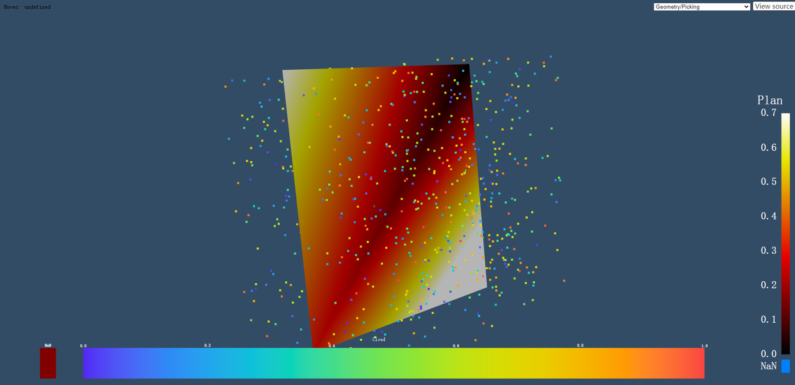

Kitware/react-vtk-js 是vtk组织官方出的react vtk组件，运用于医学成像。
git地址: https://github.com/alexiusll/react-vtk-js

###官方简介（机翻预警）：
基于React的声明式vtk.js可视化渲染管线。换句话说，这个项目允许你利用vtk.js使用React/XML语法来描述你的3D场景。有点像X3dom的X3D格式，除了这里我们利用了React组件，可以扩展到构建自己的工具。

该项目于2021年1月份创建，属于是很新的React组件，现在迭代的速度也很快。

相比OHIF出品的 react-vtkjs-viewport 的React组件，虽然两者都是封装vtkjs的组件，但是目前 react-vtkjs-viewport 使用的VTKJS的版本老旧，为 "vtk.js": "^11.14.0", ，最新的commit 是2020年，可能官方后续不会再更新这个库了。但是Kitware 写的React组件中，使用的vtkjs版本为 "@kitware/vtk.js": "18.2.0" ，版本很新。

但是目前 Kitware/react-vtk-js 可用的文档很少，所以现在记录它的使用方法。目前只能通过React props和官方的例子大致窥探一下这个组件的使用方法。

Kitware/react-vtk-js的效果：




### 1.首先把 Kitware/react-vtk-js 代码克隆到自己的仓库

注意！！！这个项目没有yarn.lock 文件，所以如果要安装依赖，只能使用npm install ，然后再使用yarn import 来生成相应的yarn.lock。


Kitware/react-vtk-js 的项目结构包括自己封装的vtk组件，和使用例子，使用例里面依赖了自己封装的vtk组件。


使用 yarn dev 开启测试服务器，webpack执行打包操作，webpack打包的时间比较长，然后就可以看到官方的使用例。

一个医学影像体绘制的例子:


### 2.体绘制实现分析

```react
import React from 'react';
import ReactDOM from 'react-dom';

import {
  View,
  VolumeRepresentation,
  VolumeController,
  Reader,
} from 'react-vtk-js';

function Example(props) {
  const array = [];
  while (array.length < 1000) {
    array.push(Math.random());
  }
  return (
    <div style={{ width: '100vw', height: '100vh' }}>
      <View id='0'>
        <VolumeRepresentation>
          <VolumeController />
          <Reader
            vtkClass='vtkXMLImageDataReader'
            url='https://data.kitware.com/api/v1/item/59e12e988d777f31ac6455c5/download'
          />
        </VolumeRepresentation>
      </View>
    </div>
  );
}

// Render React object
ReactDOM.render(<Example />, document.querySelector('.root'));
```

源码结构非常简单，说明它封装的东西比较多。
对于医学影像系统而言，数据源十分重要，我们首先分析它的数据源的格式：
在Reader中有一个 url : https://data.kitware.com/api/v1/item/59e12e988d777f31ac6455c5/download
点开之后，发现它是一个 .vti格式的文件。

VTI文件大多属于Kitware公司的ParaView。ParaView是一种需要将大型数据集可视化的应用程序。ParaView是一个开源系统。ParaView是一个建立在VTK之上的交钥匙可视化系统，使VTK更容易使用一个点和点击界面。

前面写了一个生成数组的代码，似乎没有任何作用，把它直接注释掉，免得产生干扰。

#### 先从 Reader 进行分析

它的 props

```react
  // The ID used to identify this component.
  id: PropTypes.string,
  //  downstream  连接 端口
  port: PropTypes.number,
  // vtkClass name
  vtkClass: PropTypes.string,
  // 要从中获取数据的url集
  url: PropTypes.string,
  // 将文本数据 进行 处理
  parseAsText: PropTypes.string,
  // 设置二进制数据从base64字符串处理
  parseAsArrayBuffer: PropTypes.string,
  // 自动渲染 当 数据加载
  renderOnUpdate: PropTypes.bool,
  // 自动重置相机  当 数据加载
  resetCameraOnUpdate: PropTypes.bool,
  children: PropTypes.oneOfType([
    PropTypes.arrayOf(PropTypes.node),
    PropTypes.node,
  ]),
```

它的默认参数:
```react
  port: 0,
  vtkClass: '',
  renderOnUpdate: true,
  resetCameraOnUpdate: true,
```

体渲染的时候，vtkClass 被设置为 vtkXMLImageDataReader，看看它做了什么：

```react
import vtk from '@kitware/vtk.js/vtk.js';

if (vtkClass && (!previous || vtkClass !== previous.vtkClass)) {
      this.reader = vtk({ vtkClass });
      this.downstream.setInputConnection(
        this.reader.getOutputPort(),
        this.props.port
      );
    }
```

它通过 vtkClass 从vtk中拿了一个 reader
这里需要参考一下 vtk 的源码:

```react
var constructor = factoryMapping[obj.vtkClass];
```

发现它是一个工厂方法
而 vtkXMLImageDataReader 其实是一个vtk.js的 api
参考：
https://kitware.github.io/vtk-js/api/IO_XML_XMLImageDataReader.html

#### VolumeController

它的 props
```react
VolumeController.defaultProps = {
  size: [400, 150],
  rescaleColorMap: true,
};

VolumeController.propTypes = {
  // The ID used to identify this component.
  id: PropTypes.string,
  // Controller size in pixels
  size: PropTypes.arrayOf(PropTypes.number),
  // Use opacity range to rescale color map
  rescaleColorMap: PropTypes.bool,
};

```

它提供了一个 控制窗口


#### VolumeRepresentation
```react
/**
 * VolumeRepresentation is responsible to convert a vtkPolyData into rendering
 * VolumeRepresentation负责将vtkPolyData转换为渲染
 * It takes the following set of properties:
 *   - colorBy: ['POINTS', ''],
 *   - pointSize: 1,
 *   - color: [1,1,1],
 */
```

它的props

```react
VolumeRepresentation.defaultProps = {
  colorMapPreset: 'erdc_rainbow_bright',
  colorDataRange: 'auto',
};

VolumeRepresentation.propTypes = {
  // The ID used to identify this component.
  id: PropTypes.string,
  // Properties to set to the mapper
  mapper: PropTypes.object,
  // Properties to set to the volume
  volume: PropTypes.object,
  // Properties to set to the volume.property
  property: PropTypes.object,
  // Preset name for the lookup table color map
  colorMapPreset: PropTypes.string,
  // Data range use for the colorMap
  colorDataRange: PropTypes.oneOfType([
    PropTypes.arrayOf(PropTypes.number),
    PropTypes.string,
  ]),

  children: PropTypes.oneOfType([
    PropTypes.arrayOf(PropTypes.node),
    PropTypes.node,
  ]),
};
```

#### 最重要的 view

很长的 props 
```react
View.defaultProps = {
  style: {
    width: '100%',
    height: '100%',
  },
  background: [0.2, 0.3, 0.4],
  cameraPosition: [0, 0, 1],
  cameraViewUp: [0, 1, 0],
  cameraParallelProjection: false,
  triggerRender: 0,
  triggerResetCamera: 0,
  interactorSettings: [
    {
      button: 1,
      action: 'Rotate',
    },
    {
      button: 2,
      action: 'Pan',
    },
    {
      button: 3,
      action: 'Zoom',
      scrollEnabled: true,
    },
    {
      button: 1,
      action: 'Pan',
      alt: true,
    },
    {
      button: 1,
      action: 'Zoom',
      control: true,
    },
    {
      button: 1,
      action: 'Select',
      shift: true,
    },
    {
      button: 1,
      action: 'Roll',
      alt: true,
      shift: true,
    },
  ],
  pickingModes: [],
  showCubeAxes: false,
};

View.propTypes = {
  // The ID used to identify this component.
  id: PropTypes.string,
  // Allow user to override the default View style { width: '100%', height: '100%' }
  style: PropTypes.object,
  // Allow user to provide custom className associated to root element
  className: PropTypes.string,
  /**
   * The color of the view background using 3 floating numbers
   * between 0-1 of Red, Green, Blue component.
   */
  background: PropTypes.array,
  // Configure the interactions
  interactorSettings: PropTypes.array,
  // Initial camera position from an object in [0,0,0]
  cameraPosition: PropTypes.array,
  // Initial camera position from an object in [0,0,0]
  cameraViewUp: PropTypes.array,
  // Use parallel projection (default: false)
  cameraParallelProjection: PropTypes.bool,
  // Property use to trigger a render when changing.
  triggerRender: PropTypes.number,
  // Property use to trigger a resetCamera when changing.
  triggerResetCamera: PropTypes.number,
  // List of representation to show
  children: PropTypes.oneOfType([
    PropTypes.arrayOf(PropTypes.node),
    PropTypes.node,
  ]),
  // List of picking listeners to bind. The supported values are `click`, `hover` and `select`. By default it is disabled (empty array).
  pickingModes: PropTypes.arrayOf(PropTypes.string),
  // User callback function for click
  onClick: PropTypes.func,
  /**
   * Read-only prop. To use this, make sure that `pickingModes` contains `click`.
   * This prop is updated when an element in the map is clicked. This contains
   * the picking info describing the object being clicked on.
   */
  clickInfo: PropTypes.object,
  // User callback function for hover
  onHover: PropTypes.func,
  /**
   * Read-only prop. To use this, make sure that `pickingModes` contains `hover`.
   * This prop is updated when an element in the map is hovered. This contains
   * the picking info describing the object being hovered.
   */
  hoverInfo: PropTypes.object,
  // User callback function for box select
  onSelect: PropTypes.func,
  /**
   * Read-only prop. To use this, make sure that `pickingModes` contains `select`.
   * This prop is updated when an element in the view is select. This contains
   * the picking info describing the object being select along with the frustrum.
   */
  selectInfo: PropTypes.object,
  /**
   * Show/Hide Cube Axes for the given representation
   */
  showCubeAxes: PropTypes.bool,
  /**
   * Configure cube Axes style by overriding the set of properties defined
   * https://github.com/Kitware/vtk-js/blob/HEAD/Sources/Rendering/Core/CubeAxesActor/index.js#L703-L719
   */
  cubeAxesStyle: PropTypes.object,
};
```

在示例项目中 view 只传入了 id，其他都为默认参数 
基本来看，默认参数设置了一些view窗口的操作方式，和它的样式

