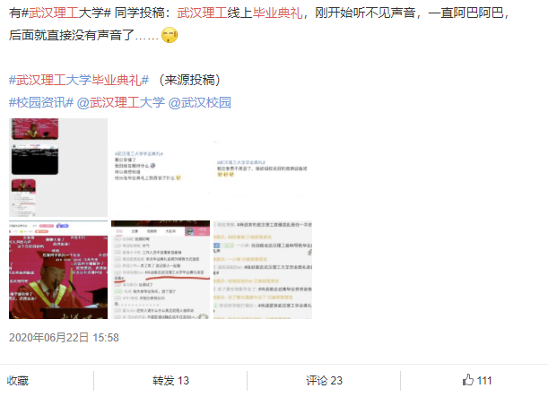
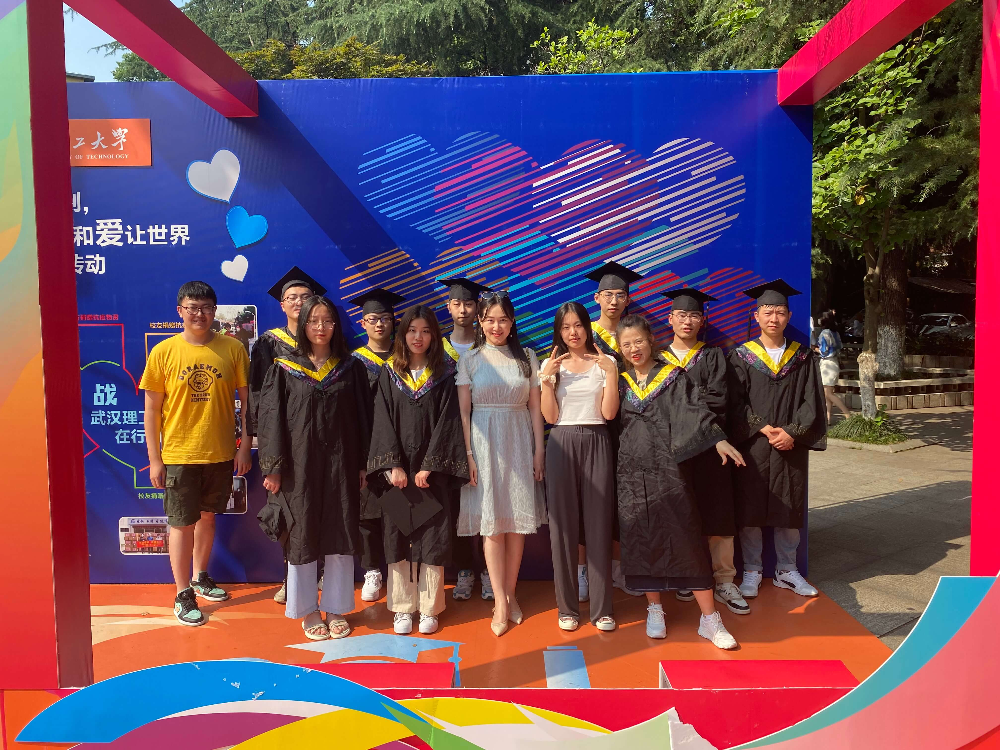
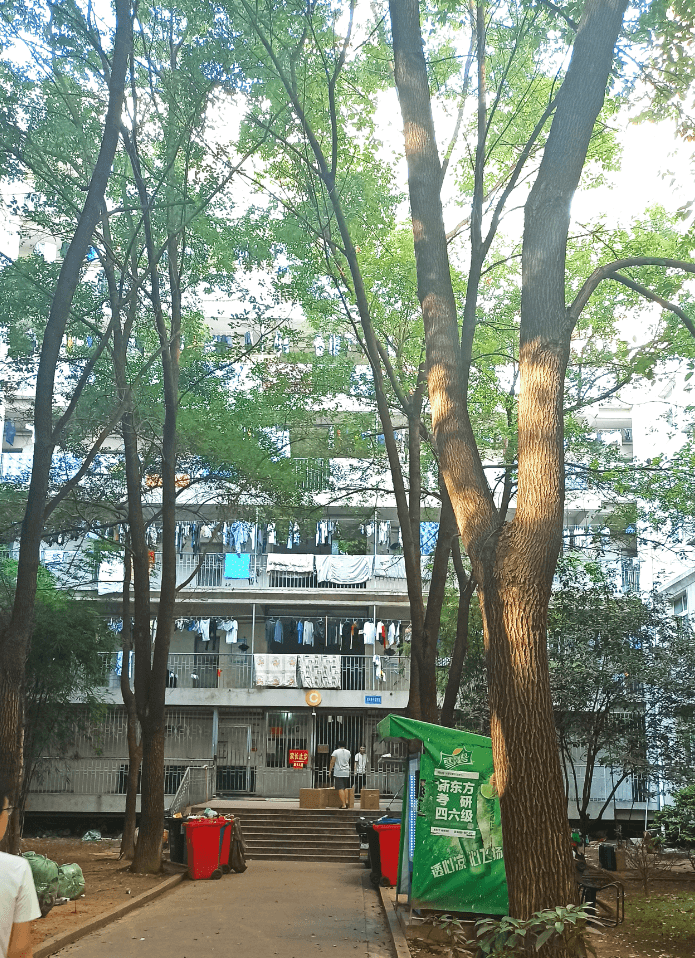
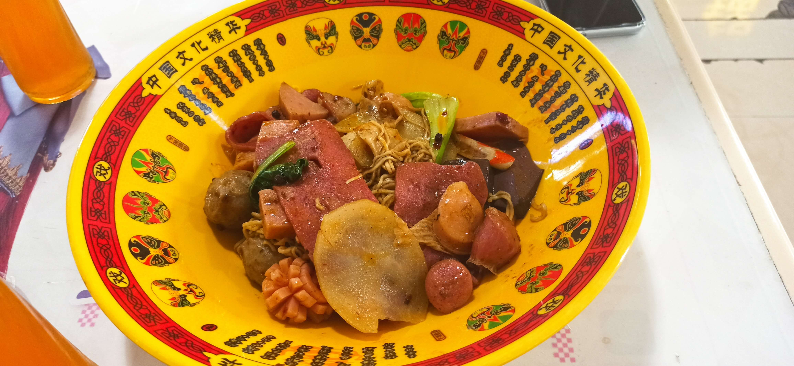

不太擅长写小作文哈，想着博客好不容易弄好，得写点东西装饰一哈，我语文不太好，写东西喜欢记流水账，图一乐就好哈哈..

### 🟠朝花夕拾

​    2020年由于疫情的缘故，始终不能返校，大概6月初的时候，学校只给我们留了一天的时间，让我们把寝室里的东西收拾回去，当时有一个室友，回不来学校，我们只能帮他把东西邮寄回去，面都见不到。没有一个像样的同学道别会，没有线下的毕业典礼，更没有毕业旅行，我们就这样匆匆毕业了...
<!-- more -->

​    后来，学校搞个很拉跨的线上的直播，当时我们还在微博上吐槽这个事情：

学校搞直播这方面还是没什么经验啊，整场直播只能用事故来形容...

但是同学们在b站刷的弹幕还是很有节目效果的233333

### 🟤重返理工

​    今年6月中旬的时候，我收到了通知，说2020可以作为校友去参加毕业典礼。我想我就在隔壁读研，去一趟也挺方便，于是就欣然报名了。一同去的还有本科的室友，文中就简称裴宝。

​    6月22号的早上我们集合之后，就直接去了武汉理工大学的西院，我们将在西院礼堂举办毕业典礼。到了之后，我们先是找本院毕业的同学，由于现在疫情又变得严重了，又或者大家都到了五湖四海，事业繁忙，难以抽出时间，比如我的另外2个室友都身处外地，不方便过来，所以今天能来的同学不多。我们简单的交流了一下现在的情况，我聊到的几个同学都还在读研究生，听说他们的导师是放养式，平时事不多，突然有点羡慕😅...想想后面web影像系统的开发任务，人有点麻

​    

### 🔵毕业典礼

​    在我们换上学士服之后，去了西院礼堂，经过简单的排练后，毕业典礼就开始了...

17级的导员给我发了学校的纪念版口罩：

校长进行了发言，然后是学生代表进行发言，之后就是校长和代表给在场学生进行授予学位的环节了。

​	我们五个人一组上台被授予学位，期间还有点小紧张，实际上这就是一个带有仪式感的环节，领导会和你握手，然后学生帽的穗很讲究，未授予学位前，要摆放在学士帽右前侧中的位置，授予学位的时候领导会把穗放到左前侧中的位置。我当时有点铸币，低头的时候时间好像太短，领导还没把穗放好我就抬头了，然后我又低头让领导把穗放好，弄好了之后递归我一个红色丝带系好的卷轴样子的东西，然后和领导合影，这个环节就结束了。我原本以为这个卷轴是给我的证书什么的，后来下台之后其实是要归回的，等于说就是一个仪式感的东西。

​	最后所有人一起唱了校歌，毕业典礼就结束了。

### 🟡南湖校区

​    毕业典礼结束之后，我们召集了到了的同学，一起合了影。那天真的很热，人就快要化掉的那种。

​	之后浦大佬带我们去南湖校区，打算先沿路参观一下，然后再回到升升公寓看看。浦大佬现在在武汉理工都研究生，不过转去了艺术设计专业。她带我们参观了艺术设计学院的大楼，真的很气派，里面的装修和设施也很新，比我们的好多了。听说南湖校区又起了很多新楼，似乎大学都有这种遗憾啊，就是毕业了之后xx设施才最终修好，不过我们这一届比较幸运的是一去图书馆就是建好的，理工大南湖的图书馆算是很不错的了。

​    现在，南湖校区的门口食堂修的真不错，里面入驻了很多商家，电影院，日料，火锅，M记，各种小吃，该有的都有，如果不是看到有学生在里面自习，仿佛不是身处大学，而是到了商业中心。

​	短暂停留之后，我们就回了升升。

### 🟣再回升升

​	大学四年的时光都是住在升升公寓，这似乎理工大在外面租的公寓群，刚来的时候，我还会抱怨，升升公寓里面环境脏乱差，没有铺地板，去南湖校区也远，走路常常要花30分钟才能到教学楼，很不方便。但是现在只觉得升升公寓真的是好。吃的东西多，因为是在校外设置的，入驻的商家很多，什么吃的东西都有。而且升升公寓不限电，懂得都懂哈...另外独卫和空调这些也是有的。还有一个好处就是买外卖也很方便，如果是在校内的公寓，外卖可能还不好送进来。我们以前点了外卖，是可以直接送到楼底下的。什么寝室环境不好，没有地板的问题，完全可以自己发扬一下DIY精神嘛，去淘宝买点自己铺的地板，回来自己铺一下，打扫一下，这都不是问题哈哈。

​	时隔一年再次回到升升公寓，发现升升北门的小吃街又开张了（之前因为火灾关了很长时间），只不过之前熟悉的一些商户走了，比如门口的豆腐，章鱼烧什么的，现在小吃街前头被改成一个小超市的样子。往里面走，发现了一些之前经常买的商铺。比如什么锅盔，包面都还在，以前经常来这买锅盔来着，挺好吃的，好像升升在我回忆中占了绝大部分的东西都是吃的哈哈。

​	之前有传言说，升升公寓好像要改成给技术学院的学生来住，本升专....但是似乎现在还是武汉理工的学生在住，这一次没有找学生问一下有点可惜。

​	我和裴宝迫不急待的就走到了以前住的公寓楼，C栋，这里还是和原来的样子一样，但是社管阿姨好像已经换了。

​	

​	门口有些同学好像在收拾行李，可能是因为毕业要离开了吧。因为没有门禁卡，我们像以前一样，跟着要进去的同学”混“了进去。

​	我们马上去了以前住的253寝室，现在它已经有了新的主人，我和裴宝只能在门口看看，我们以前安装的门帘还是在那个地方。我们之前安装地板的时候可是花了好大的功夫，希望现在的主人能好好善待它...

​	晚餐我们直接在升升的食堂吃的，我选了之前经常吃的一家麻辣香锅。味道似乎没有之前的好吃了，感觉变淡了一点，呜呜呜，难道是因为回忆滤镜吗？

​	坐在升升的食堂和以前的室友吃饭，仿佛又回到了大学本科的时光，等下吃完得赶去南湖上课。

​	到了差不多6点，我离开升升公寓，走着熟悉的回家路，现在这里8号线地铁站已经修好了，不需要坐公交了，在这里，搭上崭新的地铁，回到读研的学校，继续现在的生活。

### 🟢我毕业了

