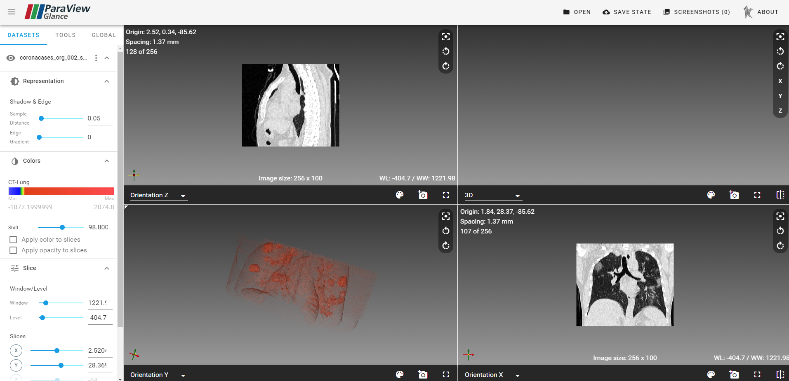

## 🔷简介

paraview-glance 是kitware组织开源一个像vtk的最佳实践的东西，阅片的效果还不错：
<!-- more -->


它的代码仓库在：

https://github.com/alexiusll/paraview-glance

后续影像系统的开发可能得参考这个库来做，所以得看看它的源码，了解一下官方是怎么实现这个效果的。


## 🔵开启dev服务器

```shell
$ git clone https://github.com/Kitware/paraview-glance.git
$ cd paraview-glance/
$ npm install
$ npm run build
$ npm run dev
```

实际上安装了依赖之后，直接使用

```shell
$ yarn dev
```

就可以执行了。

依然要注意这个repo没有使用yarn.lock，所以请不要用yarn指令直接安装依赖

开启dev服务器之后，webpack会开始工作...

等编译好后，直接进入 http://127.0.0.1:9999/ 就可以了


### ❌窗口出现错位的问题

拉取最新的代码的时候，窗口会出现错位的问题，3D的地方就是空的，看来源码有点问题啊...



打算尝试解决一下这个问题。

但是看了一下issue里面，似乎没有人去提这个问题，于是我去提了一下，现在还没有人回复（第一次提issue，哈哈哈）。

目前来说，只能先回退版本了，我发现回到v4.14.0的版本是正确的，那么就先在这个版本上新建一个分支来继续吧。


## 🟦框架简介

这个项目用了VUE的框架来做，我之前都是用的React框架，对这个不熟悉，悲...

### 先从依赖开始看起（部分机翻）：

- "@girder/components": "^2.2.4",                        kitware组织自己的组件库 （Vue + Vuetify）
-   "@linusborg/vue-simple-portal": "^0.1.3",      Vue的简单门户实现，用于将槽内容挂载到另一个元素
-   "itk": "13.1.4",                                                       用来转换文件格式用的
-   "mousetrap": "^1.6.3",                                        简单的库处理键盘快捷键
-   "pug": "^3.0.0",                                                     一种用于编写HTML的干净、空格敏感的模板语言
-   "pug-plain-loader": "^1.0.0",                              pug的loader
-   "typeface-roboto": "0.0.75",                               CSS和web字体文件，轻松地自我主机“Roboto”。
-   "vtk.js": "15.4.0",                                                   核心库，渲染医学影像
-   "vue": "2.6.11",                                                      使用了vue作为前端框架
-   "vue-cli-plugin-vuetify": "^2.0.7",                       A Vue CLI 3用于安装Vuetify的插件
-   "vuetify": "2.3.4",                                                  Vue 上面的UI库
-   "vuex": "^3.5.1",                                                    Vuex 是一个专为 Vue.js 应用程序开发的**状态管理模式**。
-   "webworker-promise": "0.4.2",                          一个基于“webworkers”的 small promise 
-   "workbox-sw": "2.1.2"                                          该`workbox-sw`模块提供了一种极其简单的方式来启动和运行 Workbox 模块

### 总体文件结构

```
/build                      构建项目的配置文件
/data						项目的示例数据
/dist						构建的文件
/documentation				文档
/externals					第三方库
/itk						将会打包到生成的文件中
/node_modules				依赖库
/src						项目入口，核心
/static						静态文件，webpack会将它打包到生成的文件中
.babelrc					Babel 的配置文件
.browserslistrc				配置浏览器版本，这个配置能够分享目标浏览器和nodejs版本在不同的前端工具
.editorconfig				可以帮助开发者在不同的编辑器和 IDE 之间定义和维护一致的代码风格
.eslintignore				eslint 忽略规则
.eslintrc.js				eslint 规则
.gitattributes			    github配置，用来识别语言等
.gitignore					github 忽略规则
.npmignore					npm打包的忽略规则
.travis.yml					自动化部署配置
CONTRIBUTING.md				如何进行贡献的说明
COPYRIGHT					版权信息
LICENSE						授权协议
package-lock.json			包管理lock
package.json				包管理配置
prettier.config.js			代码格式配置
README.md
yarn.lock
```


## 🟦模块分析

### 🟢代码执行过程

/static/index.html

```html
  <body>
    <div id="root-container"></div>
    <script type="text/javascript">
      const container = document.querySelector('#root-container');
      const glanceInstance = Glance.createViewer(container);
      glanceInstance.processURLArgs();
    </script>
  </body>
```

**Glance.createViewer(container) **  这里创建Viewer


/src/app.js  下的 createViewer 方法

```javascript
  const app = new Vue({
    el: container, // 提供一个在页面上已存在的 DOM 元素作为 Vue 实例的挂载目标
    components: { App }, // 包含 Vue 实例可用组件的哈希表
    store,
    provide: GirderProvider,
    // if in the future we want to configure vuetify ourselves, see
    // https://github.com/girder/girder_web_components/blob/master/README.md
    vuetify: new Vuetify(girderVuetifyConfig),
    proxyManager,
    template: '<App />', // 一个字符串模板作为 Vue 实例的标识使用。
  });
```

创建了一个 vue 组件

它的选项可以参考：https://cn.vuejs.org/v2/api/#%E9%80%89%E9%A1%B9-%E6%95%B0%E6%8D%AE

生成的APP来自

```javascript
import App from 'paraview-glance/src/components/core/App';
```


### 🟡app 和 landing 页面的切换

APP/template.html

```html
      <v-content :class="$style.appContent">
        <landing
          v-if="landingVisible"
          key="if-landing"
          v-on:open="showFileUpload"
          v-on:open-urls="autoLoadRemotes"
          v-on:open-files="openFileList"
        />
        <layout-view v-else key="if-landing" />
      </v-content>
```

这里的意思是

如果 landingVisible 为 true ，则渲染 landing 组件

如果 landingVisible 为 false，则渲染 layout-view 组件


### 🟡landing 模块分析

路径 src/components/core/Landing

其实这个地方分析的意义不大，就是一个选择数据的入口，我们核心要留给阅片的部分


部分template.html 代码

```html
      <v-flex xs12>
        <span class="title">Sample Data （这里是展示数据）</span>
      </v-flex>
      <v-flex
        v-for="(sample, i) in samples"
        :key="i"
        :xs4="$vuetify.breakpoint.mdAndUp"
        :xs6="$vuetify.breakpoint.sm"
        :xs12="$vuetify.breakpoint.xs"
      >
        <v-card :class="$style.sampleData" flat tile>
          <v-img :src="sample.image" height="300px" />
          <div
            :class="$style.linkOverlay"
            @click.stop="openSample(sample)"
          >
            <div :class="$style.linkOverlayText" class="body-2">
              {{ sample.label }} ({{ sample.size }})
              <div :class="$style.description" v-if="sample.description">
                {{ sample.description }}
              </div>
              <div :class="$style.acknowledgement" v-if="sample.acknowledgement">
                {{ sample.acknowledgement }}
              </div>
            </div>
          </div>
        </v-card>
      </v-flex>
```


### 🟡LayoutView模块

template.html 代码

```html
<v-container fluid :class="$style.container">
  <div
    :class="$style.grid"
    :style="{ gridTemplateRows, gridTemplateColumns }"
  >
    <div
      :class="$style.viewContainer"
      v-for="(viewType, index) in views"
      v-bind:key="`${index}::${viewType}`"
      v-show="index < visibleCount"
    >
      <vtk-view
        v-bind:view-type="viewType"
        v-bind:layout-index="index"
        v-bind:layout-count="visibleCount"
        v-bind:background-color="backgroundColors[viewType]"
        v-on:bg-change="setViewBackground(view, arguments[0])"
      />
    </div>
  </div>
</v-container>
```

执行过程：

它会循环执行，根据用户的选择来生成相应数目的 **vtk-view** 窗口

其中 **VtkView** 这个组件来自 

```javascript
import VtkView from 'paraview-glance/src/components/core/VtkView';
```


### 🟡VtkView模块 （核心部分）

#### 1.html第一部分：右边工具栏

template.html

```html
  <v-layout column :class="$style.floatToolbar">
    <div style="color: aliceblue;">测试</div>
    <v-tooltip left :disabled="smallScreen">
      <span class="pv-no-select">Reset camera</span>
      <template v-slot:activator="{ on }">
        <v-btn icon dark v-on="on" v-on:click="resetCamera()">
          <v-icon>mdi-image-filter-center-focus</v-icon>
        </v-btn>
      </template>
    </v-tooltip>
    <v-tooltip left :disabled="smallScreen">
      <span class="pv-no-select">Rotate camera left 90°</span>
      <template v-slot:activator="{ on }">
        <v-btn icon dark v-on="on" v-on:click="rollLeft()">
          <v-icon>mdi-rotate-left</v-icon>
        </v-btn>
      </template>
    </v-tooltip>
    <v-tooltip left :disabled="smallScreen">
      <span class="pv-no-select">Rotate camera right 90°</span>
      <template v-slot:activator="{ on }">
        <v-btn icon dark v-on="on" v-on:click="rollRight()">
          <v-icon>mdi-rotate-right</v-icon>
        </v-btn>
      </template>
    </v-tooltip>
    <v-tooltip left v-if="type === 'View3D'" :disabled="smallScreen">
      <span class="pv-no-select"
        >Reset Camera to Orientation {{orientationLabels[0]}}</span
      >
      <template v-slot:activator="{ on }">
        <v-btn icon dark v-on="on" v-on:click="updateOrientation('x')">
          {{orientationLabels[0]}}
        </v-btn>
      </template>
    </v-tooltip>
    <v-tooltip left v-if="type === 'View3D'" :disabled="smallScreen">
      <span class="pv-no-select"
        >Reset Camera to Orientation {{orientationLabels[1]}}</span
      >
      <template v-slot:activator="{ on }">
        <v-btn icon dark v-on="on" v-on:click="updateOrientation('y')">
          {{orientationLabels[1]}}
        </v-btn>
      </template>
    </v-tooltip>
    <v-tooltip left v-if="type === 'View3D'" :disabled="smallScreen">
      <span class="pv-no-select"
        >Reset Camera to Orientation {{orientationLabels[2]}}</span
      >
      <template v-slot:activator="{ on }">
        <v-btn icon dark v-on="on" v-on:click="updateOrientation('z')">
          {{orientationLabels[2]}}
        </v-btn>
      </template>
    </v-tooltip>
  </v-layout>
```


#### 2.html第二部分：底边工具栏

```html
  <!-- 下侧工具栏 -->
  <v-layout column fill-height>
    <v-flex
      fill-height
      class="js-view"
      :class="$style.vtkView"
      :style="{ background: backgroundColor }"
      v-on:mousedown="view.activate()"
    />
    <div v-if="isActive" :class="$style.activeView" />
    <div :class="$style.toolbarWrapper">
      <toolbar-sheet v-model="backgroundSheet">
        <v-container grid-list-md class="mr-0">
          <v-layout row>
            <v-spacer />
            <palette-picker
              :size="24"
              :palette="palette"
              :value="backgroundColor"
              v-on:input="changeBackgroundColor"
            />
          </v-layout>
        </v-container>
      </toolbar-sheet>

      <v-toolbar dark height="45px" :class="$style.smallToolbar">
        <v-select
          dense
          flat
          hide-details
          :class="$style.viewTypeSelector"
          :items="viewTypes"
          :value="viewType"
          @change="changeViewType"
        />

        <v-spacer />

        <div>测试</div>

        <v-tooltip
          top
          v-if="type === 'View3D'"
          :disabled="smallScreen || viewPointMenuVisible"
        >
          <template v-slot:activator="{ on: tooltip }">
            <v-menu offset-y top left v-model="viewPointMenuVisible">
              <template v-slot:activator="{ on: menu }">
                <v-btn
                  :class="$style.button"
                  icon
                  v-on="{ ...tooltip, ...menu }"
                  v-show="cameraViewPoints.length"
                  :disabled="viewPointMenuVisible"
                >
                  <v-icon>mdi-camera-switch</v-icon>
                </v-btn>
              </template>
              <v-list>
                <v-list-item
                  v-for="(item, index) in cameraViewPoints"
                  :key="index"
                  @click="changeCameraViewPoint(item)"
                >
                  <v-list-item-title>{{ item }}</v-list-item-title>
                </v-list-item>
              </v-list>
            </v-menu>
          </template>
          <span class="pv-no-select">Change View Point</span>
        </v-tooltip>

        <v-tooltip top :disabled="smallScreen">
          <span class="pv-no-select">Background color</span>
          <template v-slot:activator="{ on }">
            <v-btn
              :class="$style.button"
              icon
              :disabled="backgroundSheet || !view"
              v-on="on"
              v-on:click="backgroundSheet = !backgroundSheet"
            >
              <v-icon>mdi-palette</v-icon>
            </v-btn>
          </template>
        </v-tooltip>
        <v-tooltip top :disabled="smallScreen">
          <span class="pv-no-select">Screenshot</span>
          <template v-slot:activator="{ on }">
            <v-btn
              :class="$style.button"
              icon
              v-on="on"
              v-on:click="screenCapture()"
            >
              <v-icon>mdi-camera-plus</v-icon>
            </v-btn>
          </template>
        </v-tooltip>
        <v-tooltip top v-if="!smallScreen && singleViewButton" key="singleView">
          <span class="pv-no-select">Single view</span>
          <template v-slot:activator="{ on }">
            <v-btn
              :class="$style.button"
              icon
              v-on="on"
              v-on:click="singleView(layoutIndex)"
            >
              <v-icon>mdi-fullscreen</v-icon>
            </v-btn>
          </template>
        </v-tooltip>
        <v-tooltip top v-if="!smallScreen && flipViewButton" key="flipView">
          <span class="pv-no-select">Split view</span>
          <template v-slot:activator="{ on }">
            <v-btn
              :class="$style.button"
              icon
              v-on="on"
              v-on:click="splitView(layoutIndex)"
            >
              <v-icon>mdi-flip-horizontal</v-icon>
            </v-btn>
          </template>
        </v-tooltip>
        <v-tooltip top v-if="!smallScreen && quadViewButton" key="quadView">
          <span class="pv-no-select">Quad view</span>
          <template v-slot:activator="{ on }">
            <v-btn
              :class="$style.button"
              icon
              v-on="on"
              v-on:click="quadView(layoutIndex)"
            >
              <v-icon>mdi-widgets</v-icon>
            </v-btn>
          </template>
        </v-tooltip>
      </v-toolbar>
    </div>
  </v-layout>
```


#### 修改部分代码的测试结果


显示的结果基本符合预期，但是我们关注的主要不是UI层面的东西，我们想要了解这个图像是如何进行渲染的

尝试将UI全部都注释掉，只留下渲染的部分，发现核心的代码如下：

```html
    <v-flex
      fill-height
      class="js-view"
      :class="$style.vtkView"
      :style="{ background: backgroundColor }"
      v-on:mousedown="view.activate()"
    />
```

这里只是设置了一个class 为 js-view的元素，它其实只提供一个底座的作用，用来产生一个DOM元素提供给VTK库进行渲染。


#### 渲染vtk view

/script.js

```javascript
    tryMountView(view) {
      if (this.internalViewId > -1) {
        const oldView = this.$proxyManager.getProxyById(this.internalViewId);
        this.unmountView(oldView);
        this.internalViewId = -1;
      }

      if (view) {
        this.internalViewId = view.getProxyId();
        view.setContainer(this.$el.querySelector('.js-view'));
        const widgetManager = view.getReferenceByName('widgetManager');
        if (widgetManager) {
          widgetManager.setUseSvgLayer(true);
          // workaround to disable picking if previously disabled
          if (!widgetManager.getPickingEnabled()) {
            widgetManager.disablePicking();
          }
        }
      }
    },
```

这里 view setContainer 就是选择了上文中的DOM元素，作为一个底座

