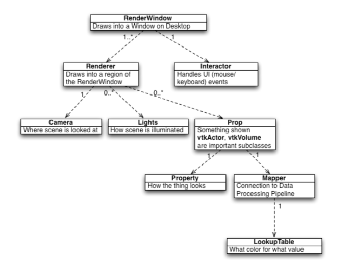
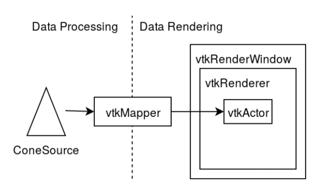
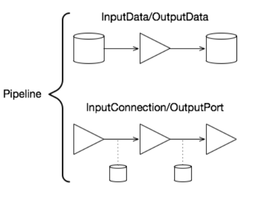

### 🔵前言

如果想要做web端的医学影像处理，如果不想从纯底层，例如webgl或者threejs开始做起，用好vtk.js就是必不可少的。这也是一个kitware组织开发的js库。
<!-- more -->

vtk.js的文档地址：

https://kitware.github.io/vtk-js/

机翻预警：

VTK.js是一个JavaScript库，可用于在浏览器中进行科学可视化。这个库可以通过NPM和(NPM ESM)或unpkg.com CDN来使用，所以它可以直接作为一个脚本标签导入到你的网页中。

本文会简单介绍如何在React代码中使用vtk.js渲染基础的图形。


### 📘准备环境

这里前端使用了umi3 的全套框架，我们先使用yarn指令获取最新的vtk.js

```shell
$ yarn add @kitware/vtk.js
```

如果想在代码中使用vtk.js的代码，还需要修改webpack的配置。在umi中修改webpack的配置的方法是，使用chainWebpack，具体可以参考umi的文档，这里不多做赘述。

我们打开node_modules下vtk.js的包，发现它的目录下有一个chainWebpack的配置，可以直接粘贴过来。

这个文件的路径在 /node_modules/@kitware/vtk.js/Utilities/config/chainWebpack.js

```javascript
export default (config: any) => {
  config.module
    .rule('vtk-glsl')
    .test(/\.glsl$/i)
    .include.add(/vtk\.js[/\\]Sources/)
    .end()
    .use('shader-loader')
    .loader('shader-loader')
    .end();

  config.module
    .rule('vtk-js')
    .test(/\.js$/i)
    .include.add(/vtk\.js[/\\]Sources/)
    .end()
    .use('babel-loader')
    .loader('babel-loader')
    .end();

  config.module
    .rule('vtk-worker')
    .test(/\.worker\.js$/)
    .include.add(/vtk\.js[/\\]Sources/)
    .end()
    .use('worker-loader')
    .loader('worker-loader')
    .options({ inline: 'no-fallback' })
    .end();

  config.module
    .rule('vtk-css')
    .test(/\.css$/)
    .exclude.add(/\.module\.css$/)
    .end()
    .include.add(/vtk\.js[/\\]Sources/)
    .end()
    .use('styles')
    .loader('style-loader')
    .loader('css-loader')
    .loader('postcss-loader')
    .end();

  config.module
    .rule('vtk-svg')
    .test(/\.svg$/)
    .include.add(/vtk\.js[/\\]Sources/)
    .end()
    .use('raw-loader')
    .loader('raw-loader')
    .end();

  config.module
    .rule('vtk-module-css')
    .test(/\.css$/)
    .include.add(/vtk\.js[/\\]Sources/)
    .add(/\.module\.css$/)
    .end()
    .use('styles')
    .loader('style-loader')
    .loader('css-loader')
    .options({
      modules: {
        localIdentName: '[name]-[local]_[sha512:hash:base64:5]',
      },
    })
    .loader('postcss-loader')
    .end();
};
```

除了 shader-loader 是vtk.js自己就有的loader之外，我们可能还需要自行安装一些loader ， 例如 babel-loader，注意部分loader的版本不要太新，否则可能可能会出现问题。

这里给出我目前的package配置：

```json
"devDependencies": {
    "@umijs/fabric": "^2.5.7",
    "@umijs/plugin-esbuild": "^1.1.0",
    "@umijs/preset-react": "^1.8.10",
    "babel-loader": "^8.2.2",
    "commitizen": "^4.2.4",
    "copy-webpack-plugin": "6",
    "cross-env": "^7.0.3",
    "css-loader": "5.2.1",
    "cz-conventional-changelog": "^3.3.0",
    "eslint": "^7.22.0",
    "lint-staged": "^10.5.4",
    "postcss-loader": "3.0.0",
    "prettier": "^2.2.1",
    "raw-loader": "4.0.2",
    "react-dev-inspector": "^1.5.1",
    "standard-version": "^9.3.0",
    "style-loader": "2.0.0",
    "webpack": "5.31.2",
    "webpack-cli": "4.6.0",
    "webpack-dev-server": "3.11.2",
    "webpack-merge": "5.7.3",
    "worker-loader": "3.0.8",
    "yorkie": "^2.0.0"
  },
```


### 📗现在可以写代码了

我们尝试实现一个最简单的 vtk.js的 demo

这里参考一下官方文档里面的例子，我第一次看vtk.js的文档还没有和react结合的例子，现在居然更了...

https://kitware.github.io/vtk-js/docs/vtk_react.html

我修改了部分代码，以适应现有的框架，例如UI的样式。

```typescript
import { useState, useRef, useEffect, FC } from 'react';

import '@kitware/vtk.js/Rendering/Profiles/Geometry';

import vtkFullScreenRenderWindow from '@kitware/vtk.js/Rendering/Misc/FullScreenRenderWindow';

import vtkActor from '@kitware/vtk.js/Rendering/Core/Actor';
import vtkMapper from '@kitware/vtk.js/Rendering/Core/Mapper';
import vtkConeSource from '@kitware/vtk.js/Filters/Sources/ConeSource';

const Demo: React.FC<{}> = () => {
  const vtkContainerRef = useRef(null);
  const context = useRef<any | null>(null);
  const [coneResolution, setConeResolution] = useState(6);
  const [representation, setRepresentation] = useState(2);

  useEffect(() => {
    if (!context.current) {
      const fullScreenRenderer = vtkFullScreenRenderWindow.newInstance({
        rootContainer: vtkContainerRef.current,
        containerStyle: {
          height: '640px',
        },
      });
      const coneSource = vtkConeSource.newInstance({ height: 1.0 });

      const mapper = vtkMapper.newInstance();
      mapper.setInputConnection(coneSource.getOutputPort());

      const actor = vtkActor.newInstance();
      actor.setMapper(mapper);

      const renderer = fullScreenRenderer.getRenderer();
      const renderWindow = fullScreenRenderer.getRenderWindow();

      renderer.addActor(actor);
      renderer.resetCamera();
      renderWindow.render();

      fullScreenRenderer.setResizeCallback(({ width, height }) => {
        console.log('resize');
      });

      context.current = {
        fullScreenRenderer,
        renderWindow,
        renderer,
        coneSource,
        actor,
        mapper,
      };
    }

    return () => {
      if (context.current) {
        const { fullScreenRenderer, coneSource, actor, mapper } = context.current;
        actor.delete();
        mapper.delete();
        coneSource.delete();
        fullScreenRenderer.delete();
        context.current = null;
      }
    };
  }, [vtkContainerRef]);

  useEffect(() => {
    if (context.current) {
      const { coneSource, renderWindow } = context.current;
      coneSource.setResolution(coneResolution);
      renderWindow.render();
    }
  }, [coneResolution]);

  useEffect(() => {
    if (context.current) {
      const { actor, renderWindow } = context.current;
      actor.getProperty().setRepresentation(representation);
      renderWindow.render();
    }
  }, [representation]);

  return (
    <>
      <table
        style={{
          position: 'absolute',
          margin: '30px',
          background: 'white',
          padding: '12px',
        }}
      >
        <tbody>
          <tr>
            <td>
              <select
                value={representation}
                style={{ width: '100%' }}
                onInput={(ev) => setRepresentation(Number(ev.target.value))}
              >
                <option value="0">Points</option>
                <option value="1">Wireframe</option>
                <option value="2">Surface</option>
              </select>
            </td>
          </tr>
          <tr>
            <td>
              <input
                type="range"
                min="4"
                max="80"
                value={coneResolution}
                onChange={(ev) => setConeResolution(Number(ev.target.value))}
              />
            </td>
          </tr>
        </tbody>
      </table>

      <div ref={vtkContainerRef} />
    </>
  );
};

export default Demo;
```


#### 📃渲染结果


#### 📓代码解析

##### 🔵React部分

**获取网页Dom元素**

```javascript
const vtkContainerRef = useRef(null);

...

<div ref={vtkContainerRef} />
```

useRef 返回一个可变的 ref 对象，其 .current 属性被初始化为传入的参数（initialValue）。

返回的  **ref 对象 ** 在组件的 **整个生命周期内保持不变。**

本质上，useRef 就像是可以在其 .current 属性中保存一个可变值的“盒子”。

请记住，当 ref 对象内容发生变化时，useRef 并不会通知你。**变更 .current 属性不会引发组件重新渲染**。


**保存上下文的属性，这一部分值的改变不会触发重新渲染**

```javascript
const context = useRef<any | null>(null);

context.current = {
        fullScreenRenderer,
        renderWindow,
        renderer,
        coneSource,
        actor,
        mapper,
      };
```


**保存coneResolution和representation，这一部分值的改变会触发重新渲染！**

```javascript
  const [coneResolution, setConeResolution] = useState(6);
  const [representation, setRepresentation] = useState(2);

  ...
  
  useEffect(() => {
    if (context.current) {
      const { coneSource, renderWindow } = context.current;
      coneSource.setResolution(coneResolution);
      renderWindow.render();
    }
  }, [coneResolution]);

  useEffect(() => {
    if (context.current) {
      const { actor, renderWindow } = context.current;
      actor.getProperty().setRepresentation(representation);
      renderWindow.render();
    }
  }, [representation]);
```


##### 🔵vtk的渲染过程

**步骤一，设置渲染窗口和渲染器**

```javascript
const fullScreenRenderer = vtkFullScreenRenderWindow.newInstance({
        rootContainer: vtkContainerRef.current,
        containerStyle: {
          height: '640px',
        },
});
...
const renderer = fullScreenRenderer.getRenderer();
const renderWindow = fullScreenRenderer.getRenderWindow();
```


**步骤二，设置数据源**

```javascript
const coneSource = vtkConeSource.newInstance({ height: 1.0 });
```


**步骤三，为cone 设置渲染流水线**

```javascript
const mapper = vtkMapper.newInstance();
mapper.setInputConnection(coneSource.getOutputPort());

const actor = vtkActor.newInstance();
actor.setMapper(mapper);

...

renderer.addActor(actor);
```


**步骤四，重置摄像头，并渲染**

```javascript
renderer.resetCamera();
renderWindow.render();
```


##### 🔵vtk的渲染流水线

资料来源是官方的ppt

https://kitware.github.io/vtk-js/docs/tutorial.html


**概要图**



**流水线**

- ConeSource提供数据

- 数据通过Mapper

- Mapper被附加到Actor

- Renderer包含许多actor

- RenderWindow 包含许多渲染器



**ConeSource**

- vtkConeSource是一个VTK过滤器

- 输出vtkPolyData的算法

  - 顶点、线和面的集合

  - 基本的vtk.js数据类型

- ConeSource算法:0输入，1输出


**流水线**

- InputData / OutputData
  - 静态:需要调用getOutputData() 来获取更新的数据
- InputConnection / OutputPort
  - 响应式:响应式:获取过滤器链的输出数据将获取给定现有参数的最新数据
- 数据可以通过多个渲染管线


