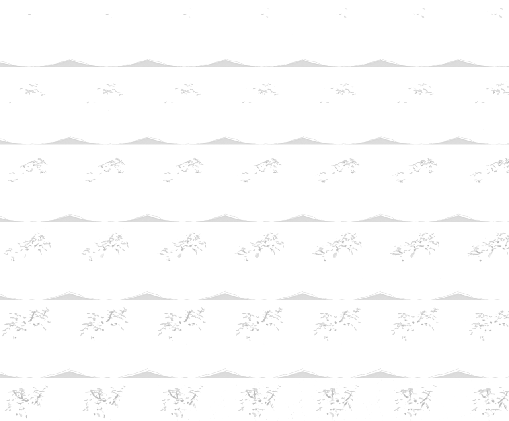
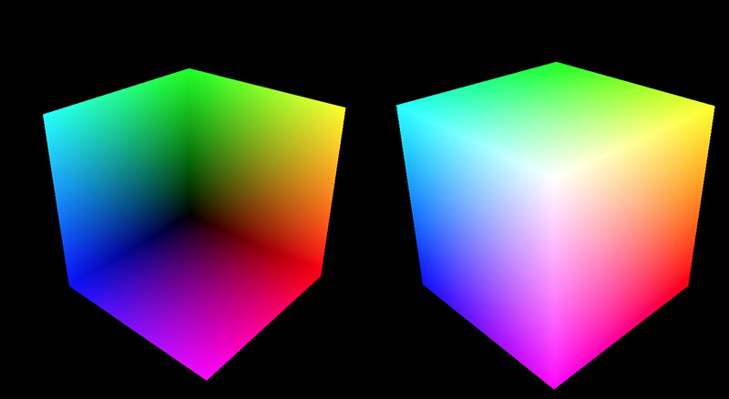
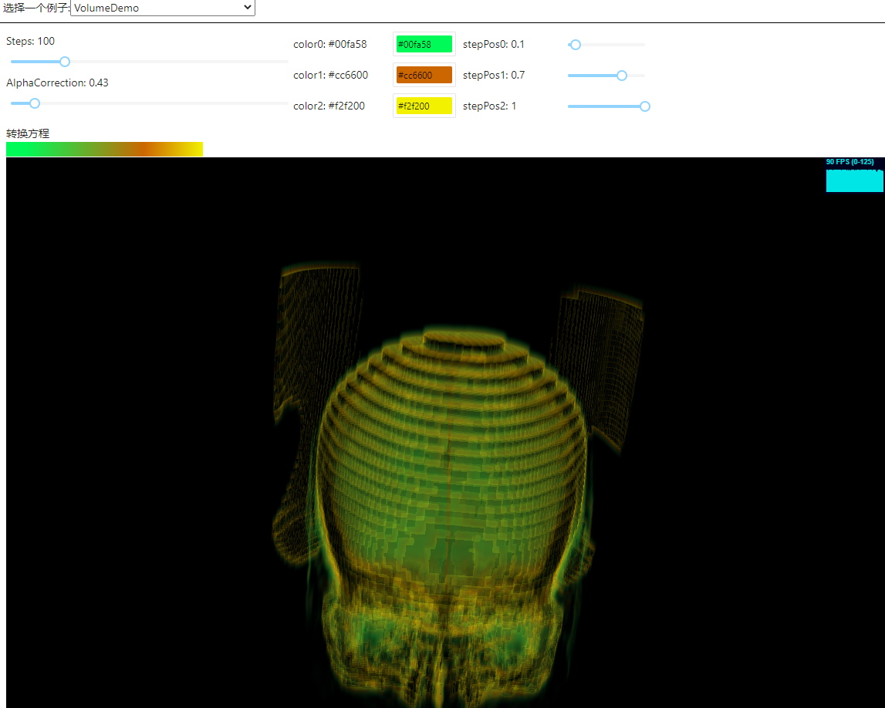

因为项目需要，现在要在web上实现一个体绘制（Volume Rendering）

本文的内容将会基于github项目: https://github.com/lebarba/WebGLVolumeRendering

多数内容翻译自文档 : http://www.lebarba.com/

<!-- more -->

## 📘什么是体绘制(Volume Rendering)?

​	与传统的渲染不同，使用三角形(triangles)来显示3D图形，体渲染使用其他方法，如 **体素光线投射算法(Volume Ray Casting)** 。这种基于图像的方法渲染一个3D标量场（scalar field）到一个2D图像通过沿着3D体素来投射光线（看不懂...）。我们在屏幕上看到的每一个像素是射线通过立方体并以一定的间隔从体素中获得强度样本的结果。

​	但是我们如何投射射线呢?

​	一个简单的方法是使用大小为(1,1,1)3D网格立方体，并且渲染正面和背面(启用和禁用背面剔除)在两个不同的渲染通道。

​	对于屏幕中生成的每一个立方体片段，我们可以创建一个射线，从立方体的正面开始，在背面结束。有了光线的起始点和结束点，我们就可以开始以固定的间隔对体素进行采样，以生成生成的片段颜色。


标量场 (scalar field) 以体素表示，这个体素包含每个(x,y,z)位置上的强度值（intensity ）


## 💙一步一步在WebGL中实现

在本节中，我们将解释使用WebGL和ThreeJS实现体绘制的实现步骤。

（根据项目的实际情况，对于原文中的步骤我会进行一些修改，并且实现方式为**React + ThreeJs**）

### ①第一步:准备数据

​	**原始文件 Raw files**（后文都叫Raw fIle) 是非常简单的文件，只包含体素强度，它们没有头部（head）或元数据（metadata），它们通常是一个8bit 或者 16bit 的强度值，每个体素以X, Y和Z的顺序排列。

​	在OpenGL或DirectX中，我们将能够在3D纹理中加载所有这些数据。但由于WebGL目前不支持存储或采样3D纹理，我们必须以一种可用于2D纹理的方式存储它（**实际上现在好像可以了...**）。出于这个原因，我们可以存储一个带有Z切片的png图像文件，从而生成2D切片的拼接图。文章作者的开发了一个包含源代码的极其简单的转换器工具。该工具使用原始文件并生成一个png图像的拼接，在alpha通道中编码每个体素的强度(尽管理想的情况是将png存储为A8格式，只是为了节省一些空间)。

​	一旦png文件作为2D纹理加载到内存中，我们可以使用我们自己的自定义sampleAs3DTexture函数将其作为3D纹理进行采样。

原文中的数据格式十分有趣：



这里只展示部分数据...实际数据太大，有将近5MB

它是由16 * 16 个图片拼接得到的，类似做2D游戏的时候，将多个素材拼接到一个材质上


因为实际上现在WebGl支持三维的纹理数据了，所以我们可以直接去生成一个三维纹理数据来作为输入。

#### 方式1 直接生成像素数据:

使用javascript来生成一个 **Uint8Array** 的 **TypedArray**

然后在循环遍历它，填充它的像素

最后将这个数组传入到 THREE.DataTexture3D 中，生成一个三维的纹理

```javascript
// create a buffer with color data
const _width = 512;
const _height = 512;
const _depth = 41;
const size = _width * _height;
const data = new Uint8Array(4 * size * _depth);
for (let i = 0; i < _depth; i += 1) {
    const color = new THREE.Color(Math.random(), Math.random(), Math.random());
    const r = Math.floor(color.r * 255);
    const g = Math.floor(color.g * 255);
    const b = Math.floor(color.b * 255);
    for (let j = 0; j < size; j += 1) {
        const stride = (i * size + j) * 4;
        data[stride] = r;
        data[stride + 1] = g;
        data[stride + 2] = b;
        data[stride + 3] = 125;
    }
}
const cubeTex = new THREE.DataTexture3D(data, _width, _height, _depth);
cubeTex.format = THREE.RGBAFormat;
cubeTex.type = THREE.UnsignedByteType;
cubeTex.minFilter = THREE.LinearFilter;
cubeTex.magFilter = THREE.LinearFilter;
cubeTex.unpackAlignment = 1;
```


#### 方式2 从DICOM文件中获取:

思路是首先从DICOM中获取16bit的rawData

然后将16bit的数据通过窗宽窗位的算法转为8bit的数据

最后将生成的8bit数据传入到 THREE.DataTexture3D 中，生成一个三维的纹理

```javascript
	// 获取真实数据
    const res = await getDicomSeriesImageData(uuid);
    if (!res) return;
    const { WW, WL, dataArray, rescaleSlope, rescaleIntercept } = store;
    const numPixels = store.xDim * store.yDim * store.zDim;
    const imgPixels = new Uint8Array(numPixels * 4);
    if (WW !== null && WL !== null) {
      for (let j = 0; j < store.zDim; j += 1) {
        for (let i = 0; i < store.xDim * store.yDim; i += 1) {
          const stride = (j * store.xDim * store.yDim + i) * 4;
          // NewValue = (RawPixelValue * RescaleSlope) + RescaleIntercept
          // U = m*SV + b
          const valScaled =
            dataArray[j * store.xDim * store.yDim + i] * rescaleSlope + rescaleIntercept;
          let val = Math.floor(((valScaled - WL + WW / 2) * 255) / WW);
            
          val = val >= 0 ? val : 0;
          val = val < 255 ? val : 255;
            
          imgPixels[stride] = val;
          imgPixels[stride + 1] = val;
          imgPixels[stride + 2] = val;
          imgPixels[stride + 3] = 255;
        }
      }
    }
    const imgTexture = new THREE.DataTexture3D(imgPixels, store.xDim, store.yDim, store.zDim);
    imgTexture.format = THREE.RGBAFormat;
    imgTexture.type = THREE.UnsignedByteType;
    imgTexture.minFilter = THREE.LinearFilter;
    imgTexture.magFilter = THREE.LinearFilter;
    imgTexture.unpackAlignment = 1;
```


### ②第二步:第一个渲染通道

​	在第二步，我们打算生成很多片段，作为射线的终点。所以对于第一个渲染通道，不绘制背面的颜色，我们将片段的World-Space位置存储在渲染纹理中，作为RGB片段颜色中的x、y、z坐标值(这里RGB被编码为浮点值)。

​	注意worldSpaceCoords是如何用于存储立方体背面位置的世界空间位置的。


**前端代码（部分）**

```javascript
const materialFirstPass = new THREE.ShaderMaterial({
    vertexShader: vertexShaderFirstPass,
    fragmentShader: fragmentShaderFirstPass,
    // 定义将要渲染哪一面 - 正面，背面或两者
    // BackSide，FrontSide，DoubleSide
    side: THREE.BackSide,
});
const boxGeometry = new THREE.BoxGeometry(1.0, 1.0, 1.0);
const meshFirstPass = new THREE.Mesh(boxGeometry, materialFirstPass);
scene.add(meshFirstPass);
```


**顶点着色器：**

```glsl
varying vec3 worldSpaceCoords;

void main()
{
    //Set the world space coordinates of the back faces vertices as output.
    worldSpaceCoords = position + vec3(0.5, 0.5, 0.5); //move it from [-0.5;0.5] to [0,1]
    gl_Position = projectionMatrix * modelViewMatrix * vec4( position, 1.0 );
}
```


**片段着色器**

```glsl
varying vec3 worldSpaceCoords;

void main()
{
    //The fragment's world space coordinates as fragment output.
    gl_FragColor = vec4( worldSpaceCoords.x , worldSpaceCoords.y, worldSpaceCoords.z, 1 );
}
```

**注解：**

**varying变量** 是vertex和fragment shader之间做数据传递用的。

**position** 哪里来的？内置的变量(uniforms)和属性 包括：

```glsl
// default vertex attributes provided by Geometry and BufferGeometry
attribute vec3 position;
attribute vec3 normal;
attribute vec2 uv;
```


**渲染结果**



​																			左边是 back side  右边是 back side


#### 使用 WebGLRenderTarget 建立缓冲

文档：

https://threejs.org/docs/index.html?q=WebGLRenderTarget#api/zh/renderers/WebGLRenderTarget

render target是一个缓冲，就是在这个缓冲中，显卡为正在后台渲染的场景绘制像素。 它用于不同的效果，例如用于在一个图像显示在屏幕上之前先做一些处理。

```javascript
// 使用NearestFilter来消除插值.  在 cube 阶段, 生成世界坐标插值
// 将在片段着色器中产生虚假的射线方向，从而产生外来的颜色。
const rtTexture = new THREE.WebGLRenderTarget(width, height, {
    minFilter: THREE.NearestFilter,
    magFilter: THREE.NearestFilter,
    wrapS: THREE.ClampToEdgeWrapping,
    wrapT: THREE.ClampToEdgeWrapping,
    // format: THREE.RGBFormat,
    type: THREE.FloatType,
    generateMipmaps: false,
});
```

**参数详解：**

**width** - renderTarget的宽度
**height** - renderTarget的高度

🤍options - (可选)一个保存着自动生成的目标纹理的纹理参数以及表示是否使用深度缓存/模板缓存的布尔值的对象 以下是一些合法选项：

**magFilter** - 默认是LinearFilter. **放大滤镜**
**minFilter** - 默认是LinearFilter. **缩小滤镜**

这2个参数代表纹理的放大和缩小，这里使用 THREE.NearestFilter

**wrapS** - 默认是ClampToEdgeWrapping.  **包裹模式**
**wrapT** - 默认是ClampToEdgeWrapping. **包裹模式**

使用RepeatWrapping，纹理将简单地重复到无穷大。

ClampToEdgeWrapping是默认值，纹理中的最后一个像素将延伸到网格的边缘。

使用MirroredRepeatWrapping， 纹理将重复到无穷大，在每次重复时将进行镜像。

**format** - 默认是RGBAFormat. **纹理的格式**  目前来看，好像必须设置成RGBA的格式，设置成别的格式会报warning？

**type** - 默认是UnsignedByteType. 用于纹理的type属性，这些属性必须与正确的格式相对应。

**generateMipmaps** - 默认是**false**.  **是否生成 Mipmaps**


#### 进行渲染，获得一个材质的缓冲

```javascript
// Render first pass and store the world space coords of the back face fragments into the texture.
renderer.setRenderTarget(rtTexture);
renderer.render(sceneFirstPass, camera);
renderer.setRenderTarget(null);
```

**使用函数：**

**.setRenderTarget **

**( renderTarget : WebGLRenderTarget, activeCubeFace : Integer, activeMipmapLevel : Integer ) : null**

renderTarget -- 需要被激活的renderTarget(可选)。若此参数为空，则将canvas设置成活跃render target。
activeCubeFace -- Specifies the active cube side (PX 0, NX 1, PY 2, NY 3, PZ 4, NZ 5) of WebGLCubeRenderTarget (optional).
activeMipmapLevel -- Specifies the active mipmap level (optional).

该方法设置活跃rendertarget。


### ③第三步:第二个渲染通道

这个渲染通道实际上是执行体积光线投射的，它从绘制立方体的正面开始，正面的每个点都是射线的起点。

顶点着色器创建两个输出:**投影坐标(片段的2D屏幕坐标)(projectedCoords)** 和 **世界空间坐标 (worldSpaceCoords)** 。

**世界空间坐标**将被用作射线起点，而**投影坐标**将被用于采样存储立方体背面位置的纹理。

**vertexShaderSecondPass.vert**

```glsl
varying vec3 worldSpaceCoords;
varying vec4 projectedCoords;

void main()
{
    worldSpaceCoords = (modelMatrix * vec4(position + vec3(0.5, 0.5,0.5), 1.0 )).xyz;
    gl_Position = projectionMatrix *  modelViewMatrix * vec4( position, 1.0 );
    projectedCoords =  projectionMatrix * modelViewMatrix * vec4( position, 1.0 );
}
```

**注解**

这里 gl_Position = projectedCoords 都是片段的2D屏幕坐标

而 worldSpaceCoords 是世界空间坐标，范围是 （0 -1）的区间


这个片段着色器的第二个渲染通道有点复杂，所以我们要慢慢分析这个部分。


​	在这个例子中，射线 R0 到 R4 是从立方体正面的片段位置投射的 （f0 到 f4 ) ，结束在立方体背面的位置(I0到I4)


#### 得到射线的向量

基于上一步的位置，我们对纹理进行采样，以获得背面片段的世界空间位置。

注意我们如何通过除以W将投影坐标转换为NDC(标准化设备坐标)，然后如何将其转换为[0;1]范围，以便将其用作UV坐标。当我们对之前渲染通道中生成的2D纹理采样时，就得到了射线的结束位置。

**fragmentShaderSecondPass.frag**

```glsl
// 将坐标从 vert shader 中传入
varying vec3 worldSpaceCoords;
varying vec4 projectedCoords;

uniform sampler2D tex;

void main( void ) {
   //转换屏幕空间坐标从 [-1;1] 到 [0;1]
    vec2 texc = vec2(((projectedCoords.x / projectedCoords.w) + 1.0 ) / 2.0, ((projectedCoords.y / projectedCoords.w) + 1.0 ) / 2.0 );
    //后面的位置 是 存储在材质中的世界空间坐标
    vec3 backPos = texture(tex, texc).xyz;
    //前面的位置 是 世界空间坐标
    vec3 frontPos = worldSpaceCoords;
   //从前面的位置 到 后面的位置 的向量
    vec3 dir = backPos - frontPos;
    // 射线长度
    float rayLength = length(dir);
	// 测试用...
    gl_FragColor = vec4( backPos.rgb, 1.0 );
}
```

然后开启正面着色的话，就会在屏幕上绘制立方体后面的位置的坐标信息。


#### 设置射线

有了front和back位置，我们现在可以创建一个从frontPos开始并以backPos结束的射线。  

```glsl
// step2
// 计算步长
float delta = 1.0 / steps;

// 计算长度
vec3 deltaDirection = normalize(dir) * delta;
float deltaDirectionLength = length(deltaDirection);

// 射线从 立方体前面位置 射入
vec3 currentPosition = frontPos;

// 设置一个颜色的累积器
vec4 accumulatedColor = vec4(0.0);

// 设置一个 Alpha 的累积器
float accumulatedAlpha = 0.0;

// 射线传播了多长的距离
float accumulatedLength = 0.0;

//If we have twice as many samples, we only need ~1/2 the alpha per sample.
//Scaling by 256/10 just happens to give a good value for the alphaCorrection slider.
float alphaScaleFactor = 25.6 * delta;

vec4 colorSample;
float alphaSample;
```


#### 射线发射

一旦射线被设置好，我们的射线将从起始位置，推进射线的当前位置到 **dir** 。

在每一步中，我们对纹理进行采样，以寻找体素强度。需要注意的是，体素只包含强度值，因此到目前为止它们还没有关于颜色的任何信息。赋予每个体素颜色的是 **变换函数 **   **transform function** 。可以看看 **sampleAs3DTexture** 函数代码，看看转换函数是如何工作的。

在我们有了由sampleAs3DTexture给出的体素颜色后，它会被 **alphaCorrection** 参数校正。你可以在线调整这个值，看看有什么不同的结果。

每次迭代的重要部分是实际的颜色构成，在这里，**accumulatedColor** 值被添加到之前存储的基于alpha值的值之上。我们还保存了一个**alphaAccumulator**，它将让我们知道何时停止射线的前进。

迭代会一直进行，直到满足以下三个条件之一:

- 射线走过的距离达到了假定的射线长度。记住，射线是从startPos到endPos。
- 累计alpha值达到100%
- 迭代达到最大常数 MAX_STEPS （本例中，由于生成的体素数据为512 * 512 * 512 的，所以MAX_STEPS 设置为 512倍的根号三，约等于887)

最后，片段着色器返回被遍历的体素值的合成结果。

```glsl
// step3
// 执行射线前进的迭代
for(int i = 0; i < MAX_STEPS; i++)
{
    // 从3D纹理中获得体素强度值。
    colorSample = getTexture(currentPosition);

    // alpha校正
    alphaSample = colorSample.a * alphaCorrection;

    // 将这种效果应用于颜色和alpha积累，可以获得更真实的透明度。
    alphaSample *= (1.0 - accumulatedAlpha);

    // 按步长缩放alpha 使最终颜色不受步长影响。
    alphaSample *= alphaScaleFactor;

    // 执行合成
    accumulatedColor += colorSample * alphaSample;

    // 存储到目前为止积累的alpha。
    accumulatedAlpha += alphaSample;

    // 推进射线
    currentPosition += deltaDirection;
    accumulatedLength += deltaDirectionLength;

    // 如果遍历的长度大于射线长度，或者累计的alpha达到1.0，那么退出。
    if(accumulatedLength >= rayLength || accumulatedAlpha >= 1.0 )
    	break;
}
```

改变控制面板中的 **steps** ，可以改变每条射线的最大迭代次数，可能需要相应地调整 **alphaCorrection** 值。


**注解：**

**每次迭代的步骤：**

1.  从3D纹理中获得体素强度值。（这一步利用函数 getTexture 实际上是从转换方程中获取到颜色值）
2.  alpha校正，这里默认 alphaCorrection 的值设置为 **0.1** （即实际拿到的 RGBA颜色 的 alpha 值，取它的十分之一）
3. 获取到的 alpha值 ，还要乘以 **(1.0 - accumulatedAlpha)** ，即越往后的像素点，对于 alpha累计值 的影响越小
4. 再将 alpha 的值乘以 **alphaScaleFactor** ，按步长缩放 alpha 使最终颜色不受步长影响。
5. 执行合成 ： accumulatedColor += colorSample * alphaSample;
6. 存储到目前为止积累的alpha： accumulatedAlpha += alphaSample;
7. 推进射线


### ④渲染结果：

直接渲染出来效果很差，性能表现也很一般，后续需要持续优化。


## 💜补充内容

### 如何设置转换方程？

首先设置3种颜色的数据，和它的在 0-1 区间上的位置 位置

```javascript
  const [colorSetting, setColorSetting] = useState([
    { color: '#00fa58', stepPos: 0.1 },
    { color: '#cc6600', stepPos: 0.7 },
    { color: '#f2f200', stepPos: 1 },
  ]);
```

使用canvas来生成 转换方程 的图片

它将生成为一个 three.js 中的材质数据

```javascript
  const updateTransferFunction = () => {
    console.log('colorSetting', colorSetting);
    const tfCanvasDom = tfCanvas.current;

    tfCanvasDom.height = 20;
    tfCanvasDom.width = 256;

    const ctx = tfCanvasDom.getContext('2d');

    const grd = ctx.createLinearGradient(0, 0, tfCanvasDom.width - 1, tfCanvasDom.height - 1);
    grd.addColorStop(colorSetting[0].stepPos, colorSetting[0].color);
    grd.addColorStop(colorSetting[1].stepPos, colorSetting[1].color);
    grd.addColorStop(colorSetting[2].stepPos, colorSetting[2].color);

    ctx.fillStyle = grd;
    ctx.fillRect(0, 0, tfCanvasDom.width - 1, tfCanvasDom.height - 1);

    const transferTexture = new THREE.Texture(tfCanvasDom);
    transferTexture.wrapS = THREE.ClampToEdgeWrapping;
    transferTexture.wrapT = THREE.ClampToEdgeWrapping;
    transferTexture.needsUpdate = true;

    return transferTexture;
  };
```

最后以uniform的形式传入到片元着色器中

```glsl
vec4 getTexture( vec3 texCoord )
{
    vec4 colorSample = texture(cubeTex , texCoord);
    vec3 color = texture( transferTex, vec2( colorSample.r, 1.0) ).rgb;
    return vec4(color , colorSample.a) ;
}
```

注意这里 getTexture 的方法在上文的 **射线发射** 中有使用到，即它的颜色数据从 色彩转换方程中获取

这里取色的时候，Y轴可以直接取1.0，因为这个材质在x坐标相同的时候颜色一致。X轴，取colorSample中rgb任意一个通道的值。


### 优化1：解决立方体边缘的错误

我们获取到的第一个渲染结果，有一个显而易见的问题就是它的边缘会出现一些 ”不正确的像素“

解决方案：改变 第二个渲染通道 的 片元着色器

过滤掉边缘的点不进行渲染

```glsl
//Using NearestFilter for rtTexture mostly eliminates bad backPos values at the edges
//of the cube, but there may still be no valid backPos value for the current fragment.
if ((backPos.x == 0.0) && (backPos.y == 0.0))
{
    gl_FragColor = vec4(0.0);
    return;
}
```

**效果：**


### 优化2：过滤掉一些太黑的像素

目前存在的问题的是，所有的像素的alpha都设置为了255，于是一些很黑的像素可能会遮挡视野，导致渲染的结果看起来很像一个立方体。

思路：将像素的 **alpha** 值 设置为它的灰度值

```javascript
 imgPixels[stride] = val;
 imgPixels[stride + 1] = val;
 imgPixels[stride + 2] = val;
 imgPixels[stride + 3] = val;
```

**效果：**



### 后续优化...

目前渲染出来的影像，由于原数据只有41层，层数比较少，所以锯齿感很强，要消除锯齿。

渲染效率很低，当steps值设置很高的时候，渲染速度会很卡，还需要继续优化算法

