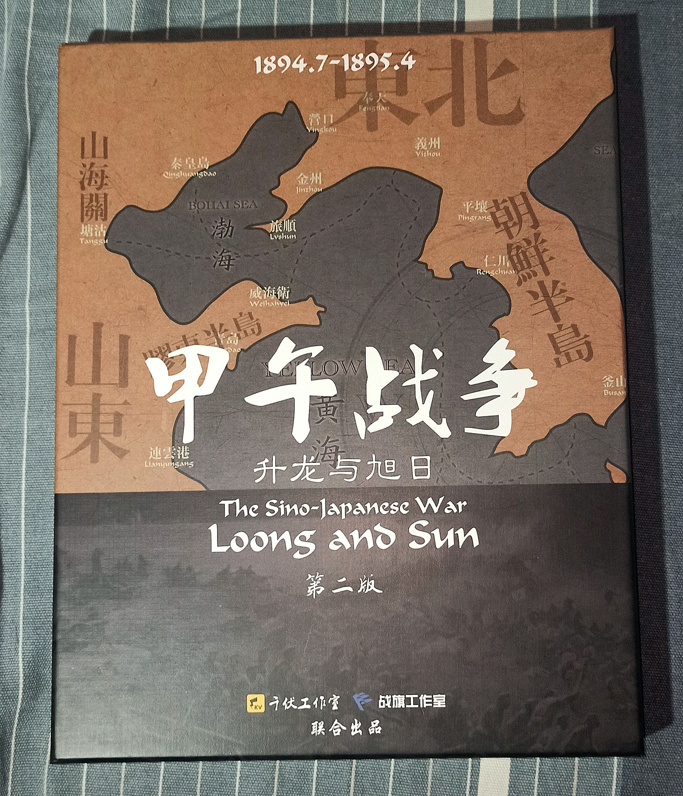
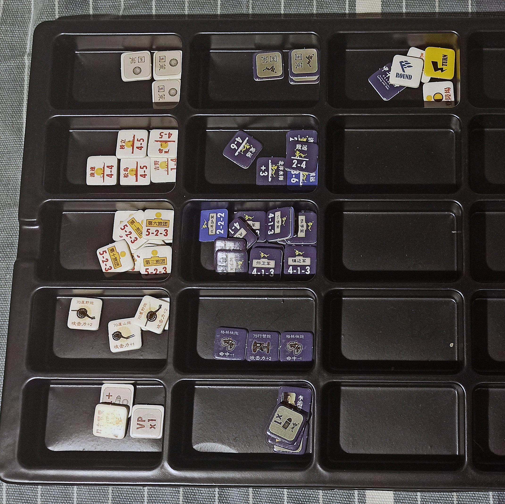
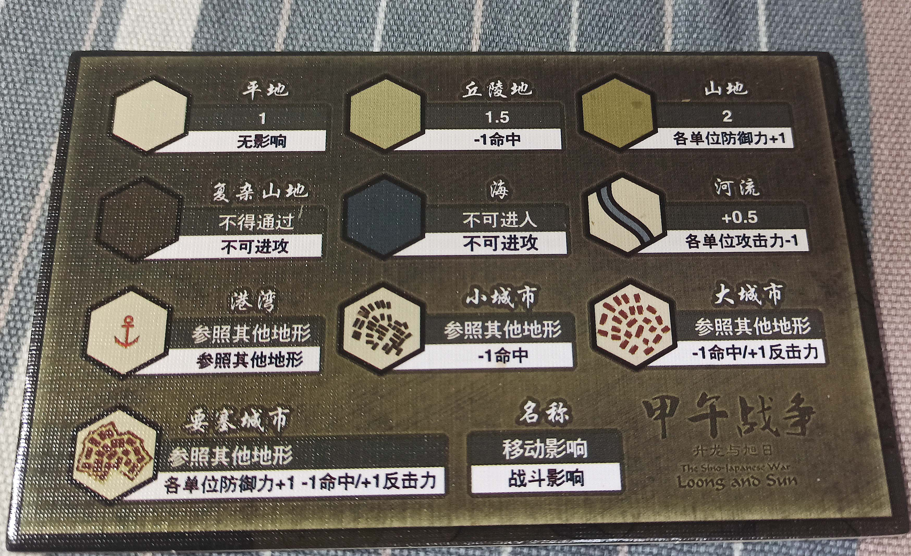
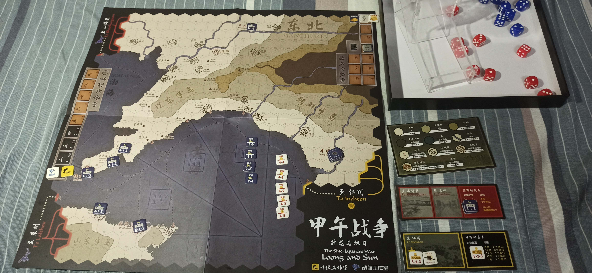

## 🟦前言

​		由于之前很爱看稚嫩的魔法师的桌游视频，魔法师很喜欢推荐一些兵棋类的桌游，于是最近趁假期想找一款简单的兵棋类桌游尝试一下。

<!-- more -->

​		查阅相关资料之后，个人感觉国内桌游是小圈子（排除狼人杀和剧本杀的话），毕竟现在的桌游馆基本都转型做剧本杀了，能找到纯粹一点的桌游馆都不是一件容易的事情，那么兵棋可能是更小的一个圈子，很多人可能停留在知道有这个东西，比如战锤40k，更多的人可能都不知道兵棋这个桌游的大类。个人感觉国内被人熟知的兵棋类桌游有《光荣之路》，《冷战热斗》，《冰与火之歌》...这些，齐中后面2款知名度应该更大一些，我之前去的一家桌游店就有《冰与火之歌》。它们好像都有祖国版（被盗印，在淘宝上可以以比较低的价格买到，说明国内都有一定知名度。

​		目前，我总结的国内比较知名的一些兵棋出版社或者代理商有：千伏工作室（淘宝店 ：[千伏工作室](https://kvgame.taobao.com/index.htm?spm=a1z10.1-c-s.w5002-12029609689.2.441e6b3e09wAH2)），战鼓工作室（淘宝店：[wdgwardrumgames旗舰店 ](https://wdgwardrumgames.tmall.com/index.htm?spm=a1z10.1-b.w5002-18129703492.2.62d160e4w50jjV)，战旗工作室 (淘宝店 ：[战旗工作室](https://wargames.taobao.com/index.htm?spm=a1z10.1-c.w5002-2618404312.2.5d1878f6RFUGrB))，香蕉桌游（淘宝店：[香蕉桌游](https://xiangjiaogame.taobao.com/index.htm?spm=a1z10.1-c.w5002-18162359612.2.2d947a06PKC6KY))，极光工作室（淘宝店：[极光工作室](https://mmtown.taobao.com/index.htm?spm=a1z10.1-c.w5002-7997127765.2.fbe36234ZSBo0F)），如果还有，欢迎补充。然后格拉摩根伯爵领（仇人家的书店x   稚嫩的魔法师的书店 [书店](https://h5.youzan.com/v2/showcase/homepage?alias=j085tepy)）里面也是有卖一些桌游的。这些店里面优秀的兵棋类的桌游还是非常多的，如果想入坑的话都可以逛一逛，里面也有很多比较便宜的入门级兵棋，非常适合新人。

​		这次入手的是一款比较入门级的兵棋类桌游《甲午战争 升龙与旭日 第二版》，由千伏工作室出品，在千伏的淘宝店可以买到。按本人的理解，兵棋类桌游的难度基本可以看它有多少的算子，这一款游戏就只有60个算子，复杂一点的兵棋通常都有超过200枚的算子。然后本人对这个题材也比较感兴趣，价格也不算很贵，还有一点就是因为是本国历史，也许存在推新的可能性？...

## 🟩简单测评

​		由于这是本人第一次写关于兵棋的测评，也是第一次玩兵棋，可能很多地方并不专业，还请大佬们海涵。

### 🤎来源

​	《甲午战争 升龙与旭日 第二版》这一款游戏，是由田岛准先生设计的，在日本桌游杂志 **gamejournal**（简称**GJ**) 的第21期中收录。（[原版游戏链接](http://www.gamejournal.net/item_list/gj_021/index.html)）原本我还想找一些这个游戏的日文版说明书，但是**GJ**的官网上翻不到😞，只能找到可以用**Vassal**（类似桌游模拟器的一个东西）打开的原版游戏，和中文的补充说明书。

​		战旗工作室和千伏工作室联合将这款游戏进行了引进，在原本的日文版规则中新增了许多中文版的规则，并且将游戏的美工进行了全面升级，修改了原版游戏中存在的一些错误。

​		本游戏着重推演甲午战争中的 **陆战部分**。

### 💙背景介绍

​		游戏的背景不用细说，相信都是大家非常熟知的一段历史。甲午战争，日本称日清战争，朝鲜称清日战争，国际通称第一次中日战争（The First Sino-Japanese War）。

​		日本顷举国之力对中国发动侵略战争，最终的结果是 日本决定性大胜，清朝惨败。需要特别注意的是，清军实际纸面数据（陆军普遍装备德式装备，北洋水师舰速略逊一筹，但吨位、火力、装甲、重炮均占优势），包括海军在类，看起来并不差，最后却以如此大的代价惨败明治维新之后的日本，其中的原因令人深思。

> ​		虽然甲午战争中，地面上的战斗远没有海战那样广为人知。但是不得不承认的是，陆上的惨败最终决定了战争的胜负走向。 —— 中文版游戏中的介绍

​		（这里的资料大部分来自wiki）

### 🔷游戏开箱

#### 包装盒

游戏提供了比较精美的包装盒，盒子挺大的。

#### 算子

游戏算子大致分为，海军，陆军，国策，装备，标记类。已经从卡纸板上拆下放入算子盒中。

#### 游戏地图+骰子+提示卡

地图包括辽宁半岛，朝鲜半岛，山东半岛，东北区域和它们的海域。

骰子官方配的是5颗 大的 **黑色骰子**。

#### 规则书

规则书总共有14页，不算长。

### 🔶简单介绍一些规则

#### 陆军算子

从左到右，分别代表这个算子的 **攻击力 - 防御力 - 移动力**

#### 游戏流程

​		本游戏每个回合分为1个动员阶段，和4个行动轮次。

​		动员阶段，需要将增援放入到对应的动员区。

​		每个行动轮次，玩家首先需要执行战略步骤，这一步原版规则需要玩家通过骰子决定军费和先后手，日军骰1个骰子，而清军玩家2个骰子，日军取骰子点数为军费，清军玩家取2个骰子中小的那一个为军费（**代表清军落后的后勤**）。如果军费相同是需要重骰的。然后双方玩家进行储备弹药，增援，动员。之后执行先手和后手方的移动，攻击和恢复。

​		游戏总共8个回合，如果玩家觉得对日军不利，可以增加第9回合。

#### ZOC

​		一般的兵棋好像都有这个东西，一个算子在周围六个格子内形成的区域就叫 **ZOC** (zone of control)，中文叫控制区。

​		敌方单位进入控制区之后可以开始交战，并且进入控制区的敌方单位必须立即停止，不能移动。

#### 海军规则

​		这个游戏有2版海军规则，一版是原版游戏中利用一个抽象的算子来作为北洋水师，另外一版是中文版规则中补充的，通过几枚海军的算子来作为日军和清军的海军。我一般采用中文版的规则。

#### 军费和弹药

​		军费和弹药的规则，是这个游戏中比较的核心，也比较特别的部分了，没有军费单位无法移动，战斗等，没有弹药损失的单位就无法回复，也无法进行攻击和反击。

​		日军和清军玩家要计算好军费，精打细算，并且储备足够的弹药，才能在游戏中取得胜利。

#### 登陆和海运

​		由于这个游戏中回合数比较少，并且那个时候没有机械化步兵师，所以部队的移动速度都很慢，双方每个单位都只有3点移动点，并且部分地形还要付出不止1点的移动点来移动。

​	这样一来，利用海运和登陆战（只有日军能进行登陆战）十分关键！清军玩家要尽量在 黄海大海战 失去海域控制权之前尽可能进行部队和装备的运输，而日军玩家也要尽快夺取海域控制权，进行部队的运输。

### 🔺需要注意的细节！

#### 1.反击的命中如何分配？

​		在游戏中容易出现多打一的情况，例如下图中，3个日军单位攻击一个清军单位：

​		例如清军反击命中3点，萌新可能会认为3点命中可以平均分配个每个日军单位，1人一点命中，最后都没超过防御，无事发生。

​		实际上这样是 **错误的**，反击的命中分配和攻击类似，优先将命中分配给一个完整的单位，也就是说这3点命中先分配给一个完整的日军的单位，一个日军单位承受损失，另外剩余的1点分配给另一个日军单位，没超过防御值，另一个日军单位无事发生。

​		最后反击的结果是一个日军单位需要承受损失。

#### 2.清军的胜利点是怎么结算？

​		在14.0中文版补充规则中，加入了外交国策的规则，里面出现了清军的胜利分：

​		但是，这个游戏是只计算日军的胜利分的，日军在游戏结束的时候有20分，或者降低难度，有17分，认为日军胜利，否则清军胜利。

​		那么这里的胜利分似乎没有作用？这里我询问了一下千伏工作室的负责人，得到的回复是：这里如果清军加胜利分，则日军最后结算的时候扣掉这些日军的胜利分，如果清军减去胜利分，则相当于日军增加对应的胜利分。

### 🔴规则书中可能的错误

关于移动，规则书中有一个图例进行介绍。

但是和提示版中的信息不符：

​		例如跨河只多消耗0.5的移动力，而图例中的山地，实际应该是丘陵地，只需要消耗1.5行动力。

​		我实际游玩的时候，根据提示版中的信息为准。

### ⚪总结和个人理解

​		总体来说 《甲午战争 升龙与旭日 第二版》 是一款非常不错的入门级兵棋，它用为数不多的算子来演绎整个甲午海战的过程，个人觉得有推新的可能，我也和同学开了一把，过程十分焦灼😂。

​		原版游戏中通过骰子来决定中日双方的军费可能造成不好的体验，这里如果骰运不好，可能双方玩家每次都只能获得1点，2点军费，清军玩家比日军玩家往往更惨，每次只能获得少的可怜的军费，造成清军玩家每回合都做不了什么事情。所以中文版补充规则中，可以使用每轮次固定的军费和先后手，而不进行骰子判定。

​		**海战十分关键！！！**前文中也说了，本游戏由于双方军队的移动力都很少，所以需要借助海运或者登陆战来快速运输部队，制海权的争夺就变得十分关键。原版游戏中清军一定会在第四回合前丢失制海权（黄海大海战），而中文版补充规则中，如果日军骰运不好（互相都无法击伤，尬住了），可能出现一直获取不了制海权而输掉游戏的情况，例如和同学开的那一把，日军到了第七回合才取得制海权来运输部队，但是为时已晚。

​		**清军只要拖住就可以取得胜利！**这个游戏的进攻压力完全在日方，清军玩家完全可以选择不进攻来节省军费，仅仅通过反击，以逸待劳。在我自己的推演中，清军玩家似乎更容易获胜，所以可能补充规则中才提出，为了平衡可以采用第9回合，或者日军17分就算获胜。

​		**不要急于进攻！**进攻需要消耗弹药和军费，而且可以多用一点弹药来进行炮火准备，所以如果急于进攻可能无法对敌人造成减员。进攻方可以多囤积一些弹药和军费，调度更多军队，来给予敌人毁灭性的一击。

## 🟧简单推演流程

这里简单推演第一个回合的4个轮次。采用平衡性规则，取消投骰子决定先后手和军费。补充装备的规则。

### 游戏准备：

清军在旅顺，奉天，平壤，威海卫地区囤积守军，2个单位待增援。海军在第1海域部署。

日军1个单位待增援，1个单位和火炮在仁川后方区域。海军在第1海域部署。

### 第一回合 第1轮次

日海军进入海域2，与清军发生遭遇战：

日军所有军舰攻击定远号，清军所有军舰攻击吉野号。

日军刚好击中6次，清军击中5次，清军定远号被击伤，而日军吉野号被击伤。

日海军撤回到第1海域

日军获得3军费，清军获得2军费，日军先手。

日军囤积2发弹药，将1个单位增援到 至仁川

清军玩家消耗2点军费将 烟台 的部队运输至 安东。

### 第一回合 第2轮次

日海军再次进攻

清海军 **定远** 被击沉，日海军 **浪速** 被击伤

清海军总战力下降至8点，日海军总战力下降至14点

日军获得4军费，清军获得3军费，日军先手。

日军囤积2个弹药，启动2个部队挺进平壤周边，攻击清军守兵：

日军跨河攻击，每个单位减1攻击力，由于带了70厘野炮，增加2点攻击。总共4+4+2=10点攻击力，投掷10枚骰子。

清军反击，2个单位8点攻击力，由于平壤是大城市，加1反击力，所以最后9点攻击力，投掷10枚骰子。

（投骰子的时候，如果结果为5或者6点，就为一次命中）

最后，日军命中4次，由于平壤是大城市，减1点命中，由于清军装备，减1点命中，最后命中2次，2个清军单位均受损伤。

清军反击命中3次，1个日军单位受到损伤

轮到清军玩家，清军玩家选择使用一个弹药恢复一个在平壤的单位，清军玩家消耗2点军费启动部队，撤退至安州，避免被围歼。

### 第一回合 第3轮次

双方海军皆无战果

日军获得3军费，清军获得2军费，日军先手。

日军占领平壤并挺进，清军囤积弹药。

### 第一回合 第4轮次

清海军 **镇远** 被击伤

日军获得4军费，清军获得3军费，日军先手。

日军攻击安州，清军被击退，日军战后挺进至安州。

清军撤退至义洲，尝试在安东一带建立防线

