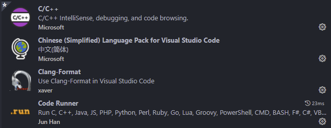
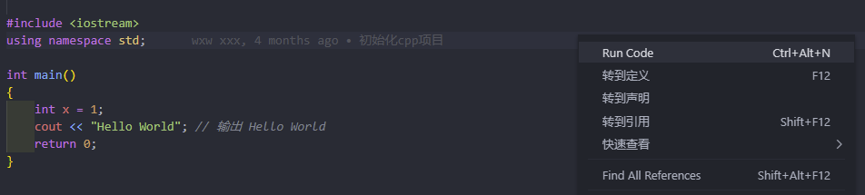
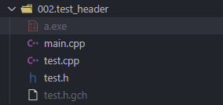

​		最近感觉还是需要学习一下C++，之前虽然已经搭建了一个vscode的c++运行环境，但是当时的搭建过程都没有记录下来，现在已经不知道该怎么用了，所以现在重新写一个c++的搭建过程。

​		本文基本都是对知乎用户回答的整理和归纳，感谢 [谭九鼎](https://www.zhihu.com/people/tan-jiu-ding)

<!-- more -->

## step.1 GCC环境的准备

### 1.1 下载编译器

MinGW-w64 - for 32 and 64 bit Windows

https://sourceforge.net/projects/mingw-w64/files/

往下稍微翻一下，选最新版本中的x86_64-posix-seh。最好不要用 Download Latest Version。

> ​		MinGW是gcc在Windows下的移植，gcc是世界上最流行的C/C++编译器组合。但gcc这个名字也指编译C语言的那个程序，g++才是C++编译器。即gcc程序和g++程序包含在gcc套件以及MinGW里，当只说gcc时要根据语境自己区分。
>
> ​		其实MinGW和MinGW-w64只是名字像，它们是两个不同的项目。为了方便，本文中的MinGW指的其实都是MinGW-w64。MinGW还活着，但只能产生32位程序。
>
> ​		现在MinGW-w64很久没有发布官方构建了，代码其实已经更新到了9.2.0，所以也可以考虑用基于它的TDM-GCC64。别下旧版，那是很久以前的，2020年发布了新版。

**我选择的版本：**

x86_64-8.1.0-release-posix-seh-rt_v6-rev0

**解压的目录：**

C:\ENV\mingw64

**设置环境变量：**

C:\ENV\mingw64\bin


### 1.2 验证是否成功

按Win+R，运行cmd（不要跳这一步），输入gcc

输gcc -v可以显示出gcc的版本。


## step.2 配置vscode环境

### 2.1 安装插件

**必须安装的扩展**

- C/C++：又名 cpptools，提供Debug和Format功能
- Code Runner：右键即可编译运行单文件，很方便；但无法Debug

**其他可选扩展**

- Bracket Pair Colorizer 2：彩虹花括号
- One Dark Pro：大概是VS Code安装量最高的主题

**不建议/不需要装的扩展**

- GBKtoUTF8：把GBK编码的文档转换成UTF8编码的。此扩展很久没有更新了，也有严重的bug
- C++ Intellisense：用的是gtags，效果不咋样
- Include     Autocomplete：提供头文件名字的补全，现在cpptools和vscode-clangd都已经自带这个功能了
- C/C++     Snippets：Snippets即重用代码块，效果自己百度；这个扩展安装量虽高，不过个人感觉用处实在不大，cpptools和clangd也自带一些；你也可以选择其他的Snippets扩展甚至自定义




### 2.2 修改配置文件 launch.json

**参考链接：**

https://code.visualstudio.com/docs/cpp/launch-json-reference

externalConsole可根据自己喜好修改；

cwd 默认设置为 ${workspaceFolder} 可以是程序运行时的相对路径，如有需要可以改为${fileDirname}（感谢@xhx）；

type和request不变色是正常现象。

```json
{
  "version": "0.2.0",
  "configurations": [
    {
      "name": "(gdb) Launch", // 配置名称，将会在启动配置的下拉菜单中显示
      "type": "cppdbg", // 配置类型，对于C/C++可认为此处只能是cppdbg，由cpptools提供；不同编程语言不同
      "request": "launch", // 可以为launch（启动）或attach（附加）
      "program": "${fileDirname}/${fileBasenameNoExtension}.exe", // 将要进行调试的程序的路径
      "args": [], // 程序调试时传递给程序的命令行参数，一般设为空
      "stopAtEntry": false, // 设为true时程序将暂停在程序入口处，相当于在main上打断点
      "cwd": "${workspaceFolder}", // 调试程序时的工作目录，此为工作区文件夹；改成${fileDirname}可变为文件所在目录
      "environment": [], // 环境变量
      "externalConsole": true, // 使用单独的cmd窗口，与其它IDE一致；为false时使用内置终端
      "internalConsoleOptions": "neverOpen", // 如果不设为neverOpen，调试时会跳到“调试控制台”选项卡，你应该不需要对gdb手动输命令吧？
      "MIMode": "gdb", // 指定连接的调试器，可以为gdb或lldb。但我没试过lldb
      "miDebuggerPath": "gdb.exe", // 调试器路径，Windows下后缀不能省略，Linux下则不要
      "setupCommands": [
        {
          // 模板自带，好像可以更好地显示STL容器的内容，具体作用自行Google
          "description": "Enable pretty-printing for gdb",
          "text": "-enable-pretty-printing",
          "ignoreFailures": false
        }
      ],
      "preLaunchTask": "Compile" // 调试前执行的任务，一般为编译程序。与tasks.json的label相对应
    }
  ]
}
```


### 2.3 修改配置文件 Tasks.json

**参考链接：**

https://code.visualstudio.com/docs/editor/tasks

如果是**编写C++**，编译器需改成g++。

MinGW的-std=c++17好像有问题，最好至多到c++14，但好像默认用的就是合适的，c语言版本也超过了c11，所以就别加-std了。

```json
{
  "version": "2.0.0",
  "tasks": [
    {
      "label": "Compile", // 任务名称，与launch.json的preLaunchTask相对应
      "command": "g++", // 要使用的编译器，C++用g++
      "args": [
        "${file}",
        "-o", // 指定输出文件名，不加该参数则默认输出a.exe，Linux下默认a.out
        "${fileDirname}/${fileBasenameNoExtension}.exe",
        "-g", // 生成和调试有关的信息
        "-m64", // 不知为何有时会生成16位程序而无法运行，此条可强制生成64位的
        "-Wall", // 开启额外警告
        "-static-libgcc", // 静态链接libgcc，一般都会加上
        "-fexec-charset=GBK", // 生成的程序使用GBK编码，不加这条会导致Win下输出中文乱码；繁体系统改成BIG5
        "-D__USE_MINGW_ANSI_STDIO" // 用MinGW写C时留着，否则不需要，用于支持printf的%zd和%Lf等
      ], // 编译的命令，其实相当于VSC帮你在终端中输了这些东西
      "type": "process", // process是把预定义变量和转义解析后直接全部传给command；shell相当于先打开shell再输入命令，所以args还会经过shell再解析一遍
      "group": {
        "kind": "build",
        "isDefault": true // 不为true时ctrl shift B就要手动选择了
      },
      "presentation": {
        "echo": true,
        "reveal": "always", // 执行任务时是否跳转到终端面板，可以为always，silent，never。具体参见VSC的文档，即使设为never，手动点进去还是可以看到
        "focus": false, // 设为true后可以使执行task时焦点聚集在终端，但对编译C/C++来说，设为true没有意义
        "panel": "shared" // 不同的文件的编译信息共享一个终端面板
      },
      "problemMatcher": "$gcc" // 捕捉编译时终端里的报错信息到问题面板中，修改代码后需要重新编译才会再次触发
      // 本来有Lint，再开problemMatcher就有双重报错，但MinGW的Lint效果实在太差了；用Clangd可以注释掉
    }
  ]
}
```


### 2.4 修改配置文件 settings.json

把这个文件里的东西放到“用户设置”里可以覆盖全局设置，否则只在当前工作区才有效。这两点各有自己的优势。

Code Runner的命令行和某些选项可以根据自己的需要在此处修改，想自定义或者想知道是什么意思还是参见此扩展的文档和百度gcc使用教程。如果终端用的是cmd（**Win7**默认）需要改用注释掉的，或者把`terminal.integrated.shell.windows`改为PowerShell；Win10默认就是PS就不用改。

感谢 [@Wellin Boss](https://www.zhihu.com/people/e011194994d3415968b3886ade2b588c) 提到的snippetSuggestions；不过用top有时还是有点问题的，所以改成可选。

```json
{
  // 编译器的配置
  "files.defaultLanguage": "cpp", // ctrl+N新建文件后默认的语言
  "editor.formatOnType": true, // 输入分号(C/C++的语句结束标识)后自动格式化当前这一行的代码
  "editor.suggest.snippetsPreventQuickSuggestions": false, // clangd的snippets有很多的跳转点，不用这个就必须手动触发Intellisense了
  // "editor.acceptSuggestionOnEnter": "off", // 我个人的习惯，按回车时一定是真正的换行，只有tab才会接受Intellisense
  // "editor.snippetSuggestions": "top", // （可选）snippets显示在补全列表顶端，默认是inline

  // "terminal.integrated.shell.windows": "PowerShell",

  // code-runner 的配置：
  "code-runner.runInTerminal": true, // 设置成false会在“输出”中输出，无法输入
  "code-runner.executorMap": {
    // "c": "gcc '$fileName' -o '$fileNameWithoutExt.exe' -Wall -O2 -m64 -lm -static-libgcc -fexec-charset=GBK -D__USE_MINGW_ANSI_STDIO && &'./$fileNameWithoutExt.exe'",
    // "cpp": "g++ '$fileName' -o '$fileNameWithoutExt.exe' -Wall -O2 -m64 -static-libgcc -fexec-charset=GBK && &'./$fileNameWithoutExt.exe'"
    "c": "gcc $fileName -o $fileNameWithoutExt.exe -Wall -O2 -m64 -lm -static-libgcc -fexec-charset=GBK -D__USE_MINGW_ANSI_STDIO && $dir$fileNameWithoutExt.exe",
    "cpp": "g++ $fileName -o $fileNameWithoutExt.exe -Wall -O2 -m64 -static-libgcc -fexec-charset=GBK && $dir$fileNameWithoutExt.exe"
  }, // 右键run code时运行的命令；未注释的仅适用于PowerShell（Win10默认）和pwsh，文件名中有空格也可以编译运行；注释掉的适用于cmd（win7默认）、PS和bash，但文件名中有空格时无法运行
  "code-runner.saveFileBeforeRun": true, // run code前保存
  "code-runner.preserveFocus": true, // 若为false，run code后光标会聚焦到终端上。如果需要频繁输入数据可设为false
  "code-runner.clearPreviousOutput": false, // 每次run code前清空属于code runner的终端消息，默认false
  "code-runner.ignoreSelection": true, // 默认为false，效果是鼠标选中一块代码后可以单独执行，但C是编译型语言，不适合这样用
  "code-runner.fileDirectoryAsCwd": true, // 将code runner终端的工作目录切换到文件目录再运行，对依赖cwd的程序产生影响；如果为false，executorMap要加cd $dir

  "C_Cpp.clang_format_sortIncludes": true,
  "files.associations": {
    "iostream": "cpp"
  } // 格式化时调整include的顺序（按字母排序）
}
```


### 2.5 (可选)配置文件 c_cpp_properties.json

如果你确定不需要使用别人的库，则现在的版本（0.18.0之后）**不需要创建这个文件**了，cpptools会自动使用默认的设置。所以本文也不再包含此文件的配置。

如果你自己编写了头文件又不在workspaceFolder下，或是使用别人的库，就需要手动创建这个文件放到`.vscode`下了。

模板可以参考：[Microsoft/vscode-cpptools](https://link.zhihu.com/?target=https%3A//github.com/Microsoft/vscode-cpptools/blob/master/Documentation/LanguageServer/MinGW.md)。

一些曾经的经验：

- 库的路径要加到includePath和browse里
- 如果需要递归包含，末尾加`/**`。
- 这个json不允许有注释，其实按照json标准本来就不能有
- compilerPath好像必需是MinGW的完整路径，精确到gcc.exe，否则会提示找不到头文件；Linux下是/usr/bin/gcc；但我很久没有测试过了
- Windows下的目录分隔符为反斜杠，原本应使用两个反斜杠来转义，但直接用斜杠这里也接受
- 除了配置这个文件，还需要进行别的操作。一部分可以参考下文的“多文件编译”


## step.3 运行c++ 代码

### 方法一 Code Runner 右键Run code



**其实Code Runner只是代替你手动输命令**，功能并不强，算是适用场景不同吧。


### 方法二 编译+调试

Ctrl+Shift+B 单纯编译

F5 编译加调试


编译结果为.exe 文件


开始调试后，按f11可以一步一步进行，箭头所指的那行代码就是**下一步要运行的代码**；

f5是一直运行到下一个断点，右键某一行代码可以选择一直运行到指定的那一行。

对于正常的语言，这样就可以了，但cpptools不支持just my code，导致f11会进到库函数比如printf中，超级差评。只能平常用f10，遇到调用自己的函数时再用f11。


**cmd 运行exe文件**

进入到目录下，然后

输入 xxx.exe 即可运行


### 多文件编译的情况




需要输入指令

```shell
$ g++ main.cpp test.cpp test.h
```

即可编译成功，运行.exe文件


​	如果你想使用别人的库，比如ffmpeg，可能需要在命令中指定-I、-l（小写的L）、-L。具体参数阅读那个库的文档。还可能需要把路径添加到c_cpp_properties.json里来配置Intellisense。

​	这些情况下可以考虑单独建一个工作区，不要和单文件编译的共用。其实不新建工程(Project)、只是单文件就能调试，是不利于以后使用和理解大型IDE的。不过初学也不用掌握那么多，不要觉得建工程很麻烦、不建工程就能编译很强就是了。


### 清理临时文件

可也写个bat，放到工作区里，要用的时候右键Run Code：

```shell
@echo off
echo 清理临时文件中...
del %~dp0*.exe /q /s
del %~dp0tempCodeRunnerFile.c /q /s
del %~dp0a.out /q /s
del %~dp0*.o /q /s
echo 清理文件结束...按任意键退出
pause >nul
exit
```

其中%~dp0会被替换成该批处理所在目录，这是为了防止有同学选错工作目录，误删根目录下的文件；

code runner的设置我也调整成了先切换到文件目录，双保险。


## 参考资料

Visual Studio Code 如何编写运行 C、C++ 程序？

https://www.zhihu.com/question/30315894/answer/1574277687

C/C++ for Visual Studio Code

https://code.visualstudio.com/docs/languages/cpp


