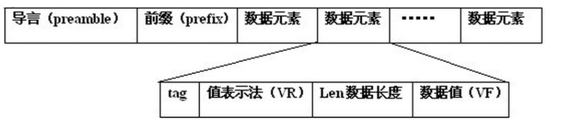

dicomParser是一个轻量级的库，用于在基于HTML5的web浏览器(IE10+)， Node.js和Meteor中解析DICOM P10字节流。

dicomParser快速，易于使用，并且没有必要的外部依赖。
<!-- more -->

github地址： https://github.com/cornerstonejs/dicomParser

之前使用daikon这个库来实现对dicom文件的处理，但是存在一部分文件无法解析的情况，于是尝试用新的库来解决这个问题。

这个库是写 [cornerstonejs](https://github.com/cornerstonejs) 这个组织写的，目前提供了大量的使用例，如下：

https://rawgit.com/cornerstonejs/dicomParser/master/examples/index.html

如果线上的地址失效了，可以将最新的源码clone下来，运行一个webpack的开发服务，也能看到例子。


## 使用例

```javascript
// create a Uint8Array or node.js Buffer with the contents of the DICOM P10 byte stream
// you want to parse (e.g. XMLHttpRequest to a WADO server)
var arrayBuffer = new ArrayBuffer(bufferSize);
var byteArray = new Uint8Array(arrayBuffer);

try
{
   // Parse the byte array to get a DataSet object that has the parsed contents
    var dataSet = dicomParser.parseDicom(byteArray/*, options */);

    // access a string element
    var studyInstanceUid = dataSet.string('x0020000d');

    // get the pixel data element (contains the offset and length of the data)
    var pixelDataElement = dataSet.elements.x7fe00010;

    // create a typed array on the pixel data (this example assumes 16 bit unsigned data)
    var pixelData = new Uint16Array(dataSet.byteArray.buffer, pixelDataElement.dataOffset, pixelDataElement.length);
}
catch(ex)
{
   console.log('Error parsing byte stream', ex);
}
```


## 官方样例解析 Getting Started 

线上地址：

https://rawgit.com/cornerstonejs/dicomParser/master/examples/gettingStarted/index.html

​	这个示例展示了如何使用dicomParser加载DICOM文件并访问其内容。将DICOM P10文件拖放到下面的区域中，可以从中选择一些属性。使用浏览器的视图源特性来查看这个示例是如何实现的，以及源代码注释。


### 源码解析

代码位置：

**.\dicomParser-master\examples\gettingStarted\index.html**


#### 1.引入dicomParser 和 jquery 的库

```html
<!-- include the dicomParser library -->
<script src="../../dist/dicomParser.js"></script>
<script>window.dicomParser || document.write('<script src="https://unpkg.com/dicom-parser">\x3C/script>')</script>

<!-- jquery - included to make things easier to demo, not needed by dicomParser -->
<script src="../jquery.min.js"></script>
```


#### 2.处理拖拽事件

```javascript
// Setup the dnd listeners.
var dropZone = document.getElementById('dropZone');
dropZone.addEventListener('dragover', handleDragOver, false);
dropZone.addEventListener('drop', handleFileSelect, false);
```

**相关参考资料：**

dragover 事件

https://developer.mozilla.org/zh-CN/docs/Web/API/Document/dragover_event

drop 事件

https://developer.mozilla.org/zh-CN/docs/Web/API/Document/drop_event


```javascript
function handleDragOver(evt) {
    evt.stopPropagation();
    evt.preventDefault();
    evt.dataTransfer.dropEffect = 'copy'; // Explicitly show this is a copy.
}
```

备注：

**stopPropagation** 阻止捕获和冒泡阶段中当前事件的进一步传播。

**preventDefault** 阻止默认动作

**DataTransfer.dropEffect** 

获取当前选定的拖放操作类型或者设置的为一个新的类型。值必须为

 `none`, `copy`, `link` 或 `move`。


一旦用户将文件放到div上，就会调用这个函数：

```javascript
function handleFileSelect(evt) {
    evt.stopPropagation();
    evt.preventDefault();

    // Get the FileList object that contains the list of files that were dropped
    var files = evt.dataTransfer.files;

    // this UI is only built for a single file so just dump the first one
    loadFile(files[0]);
}
```


触发加载文件的函数：

```javascript
// load the file dropped on the element and then call parseByteArray with a
// Uint8Array containing the files contents
function loadFile(file)
{
    var reader = new FileReader();
    reader.onload = function(file) {
        var arrayBuffer = reader.result;
        // Here we have the file data as an ArrayBuffer.  dicomParser requires as input a
        // Uint8Array so we create that here
        var byteArray = new Uint8Array(arrayBuffer);
        parseByteArray(byteArray);
    }
    reader.readAsArrayBuffer(file);
}
```

加载文件上的元素，然后调用parseByteArray 读取 Uint8Array 存储的文件内容


#### 3.使用 dicomParser 来加载文件内容

处理在加载过程中可能出现的错误;

```javascript
function parseByteArray(byteArray)
{
    // We need to setup a try/catch block because parseDicom will throw an exception
    // if you attempt to parse a non dicom part 10 file (or one that is corrupted)
    try{
        ...
    }catch(err)
    {
        // we catch the error and display it to the user
        $('#parseError').text(err);
    }
}
```


使用parseDicom库将byteArray解析为DataSet对象

```javascript
var dataSet = dicomParser.parseDicom(byteArray);
```

dataSet 包含解析的元素。

每个元素都可以通过 dataSet.elements中的属性使用。

属性名基于 elements组 和 element，格式如下:xggggeeee，其中gggg是组号，eeee是小写十六进制字符的 elements 号。


要访问元素的数据，我们需要知道它的类型和 tag。

我们将从文件中获得 **sopInstanceUid** 它是一个字符串，带有 tag (0020,000D)

```javascript
var sopInstanceUid = dataSet.string('x0020000d');
```

现在我们有了sopInstanceUid，让我们将它添加到DOM中

```javascript
$('#sopInstanceUid').text(sopInstanceUid);
```


接下来，我们将获取 患者 Id(0010,0020)。这是一个**type 2属性**，这意味着元素必须存在，但它可以为空

如果您试图获取数据长度为0(空)的元素的字符串，parseDicom将返回undefined，因此我们需要检查它以避免脚本错误

```javascript
var patientId = dataSet.string('x00100020');
if(patientId !== undefined)
{
	$('#patientId').text(patientId);
}
else
{
	$('#patientId').text("element has no data");
}
```


接下来，我们将尝试获取 其他患者id **序列(0010,1002)** 。这是一个**type 3属性**，意味着它可能存在，也可能不存在。

如果你试图为一个不存在的元素获取字符串，parseDicom将返回undefined，所以我们需要检查它，以避免脚本错误

```javascript
var otherPatientIds = dataSet.string('x00101002');
if(otherPatientIds !== undefined)
{
	$('#otherPatientIds').text(patientId);
}
else
{
	$('#otherPatientIds').text("element not present");
}
```


接下来，我们将尝试获取Rows(0028,0010)属性，这是图像所需要的。

这是 VR type US 存储，是一个 16位无符号短字段。要访问这个，我们需要使用uint16函数:

```javascript
var rows = dataSet.uint16('x00280010');
if(rows !== undefined)
{
	$('#rows').text(rows);
}
else
{
	$('#rows').text("element not present or has no data");
}
```

```javascript
// the DataSet object has functions to support every VR type:
// All string types - string()
// US - uint16()
// SS - int16()
// UL - uint32()
// SL - int32()
// FL - float()
// FD - double()
// DS - floatString()
// IS - intString()
```


接下来我们将访问 VR type 的ReferencedImageSequence(0008,1140)元素。

序列包含一个或多个项，每个项都是DataSet对象。

此属性不是必需的，因此可能不存在

```javascript
var referencedImageSequence = dataSet.elements.x00081140;
if(referencedImageSequence !== undefined)
{
    // sequence items can be empty so we need to check that first
    if(referencedImageSequence.items.length > 0)
    {
        // get the first sequence item dataSet
        var firstItem= referencedImageSequence.items[0];
        var firstItemDataSet = firstItem.dataSet;

        // now we can access the elements in the sequence data set just like
        // we did above.  In this case we will access the ReferencedSOPClassUID
        // (0008,1150):
        var referencedSOPClassUID = firstItemDataSet.string('x00081150');
        $('#referencedSOPClassUID').text(referencedSOPClassUID);
    }
}
```


接下来，我们将访问多值元素中的值。

多值元素像数组一样包含多个值。

我们将访问**ImagePositionPatient**  x00200032 元素并从中提取X、Y和Z值;

```javascript
if(dataSet.elements.x00200032 !== undefined) {
    var imagePositionPatientX = dataSet.floatString('x00200032',0);
    var imagePositionPatientY = dataSet.floatString('x00200032',1);
    var imagePositionPatientZ = dataSet.floatString('x00200032',2);
    $('#imagePositionPatientX').text(imagePositionPatientX);
    $('#imagePositionPatientY').text(imagePositionPatientY);
    $('#imagePositionPatientZ').text(imagePositionPatientZ);
}
```


在某些情况下，多值元素中的值的数量是变化的。我们可以询问值的数量，并对它们进行迭代

```javascript
if(dataSet.elements.x00200032 !== undefined) {
    var numValues = dataSet.numStringValues('x00200032');
    var text = numValues + " (";
    for(var i=0; i < numValues; i++) {
        var value = dataSet.floatString('x00200032',i);
        text += value + " "
    }
    text += ")";
    $('#imagePositionPatientNumValues').text(text);
}
```


parseDicom跟踪每个元素的长度及其在解析它的字节数组中的偏移量。

这里我们展示了如何通过直接访问元素来获得它:

```javascript
var sopInstanceUidElement = dataSet.elements.x0020000d;
var text = "dataOffset = " + sopInstanceUidElement.dataOffset + "; length = " + sopInstanceUidElement.length;
$('#sopInstanceUidDataOffsetAndLength').text(text);
```


该元素还有一些其他属性，可能存在，也可能不存在:

vr—元素的 VR 。仅对显式迁移语法可用 hadUndefinedLength - 当元素的长度未定义，为true。

```javascript
if(sopInstanceUidElement.vr !== undefined) {
	$('#sopInstanceUidVR').text(sopInstanceUidElement.vr);
}
```


## 相关名词解释

### DICOM

​	DICOM（Digital Imaging and Communications in Medicine）即医学数字成像和通信，是医学图像和相关信息的国际标准（ISO 12052）。它定义了质量能满足临床需要的可用于数据交换的医学图像格式。

DICOM 文件结构：




### VR

对象的属性——VR（Value Representations）

VR是DICOM标准中用来描述数据类型的，总共有27个值。

