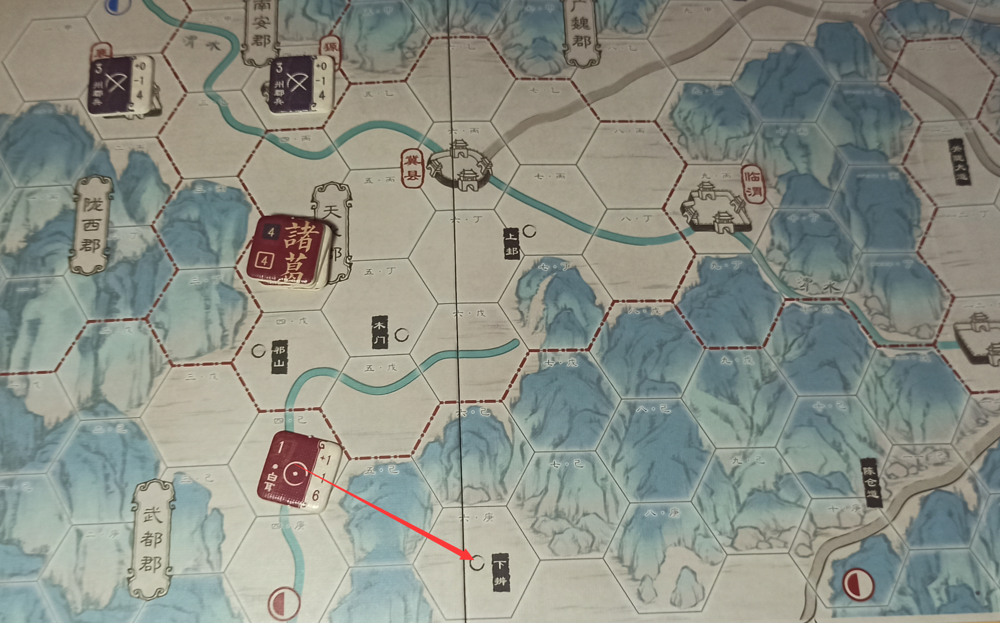
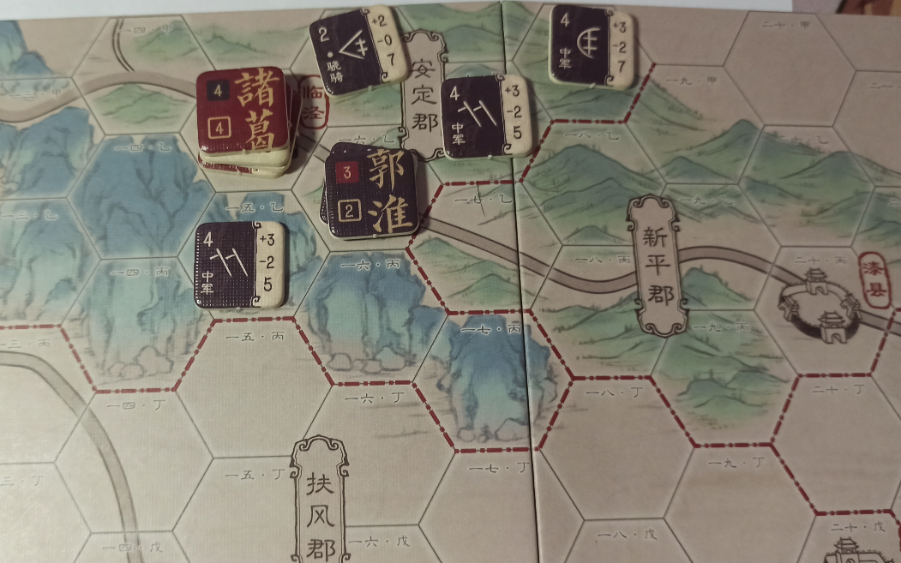

## 🟦前言

​	最近又入手了一款千伏工作室兵棋《武侯北伐》，其实这段时间入手的兵棋还是不少的，但是有些复杂程度比较高，我自己没有完整的推演下来一把，所以不好做测评。《武侯北伐》相对来说比较简单，而且和同学比较好开起来，所以简单写一下评测和一些心得。

<!-- more -->

​	在评测之前，先悼念一下《武侯北伐》这款兵棋的设计师 **南深夏** 同志。千伏工作室4月在公众号上发布了 **南深夏** 同志的讣告，很年轻就去世了，真的非常的遗憾。这里希望大家能好好爱惜自己的身体，多锻炼身体。

## 🟦简介

**千伏工作室的淘宝店：**https://kvgame.taobao.com/index.htm

**价格：**99元

**人数：**2人（实际上可以很多人玩）

**难度：**简单

**时间：**30-90分钟（熟悉了之后，每把大概60分钟）

**作品设计：**南深夏

**官方说明书：**https://www.bilibili.com/video/BV1QA411V7se

（官方说明书新手还是必看的，能快速弄懂游戏的规则）

背景就是三国啦，大家都非常熟悉的历史

## 🟦简单开箱

### 包装盒正面

### 包装盒背面

### 地图

本作地图的特点是非常的 **狭长**

但是并不大，有机会的话，甚至在办公室就可以和小伙伴开一把

### 配件

一本说明书

蜀汉 和 曹魏 的算子

控制标记

骰子一枚

玩家帮助卡一张

## 🟦简单的评测

​		这个评测拖了很长时间才回过头来写，中间也发生了不少事情，本来9月就应该写完，现在已经到了12月了。已经不太记得9月的时候和同学推演是个什么样子了，只有零星的回忆，感觉这个游戏入手的人应该还挺多，集石上的评测也不少，所以就随便写写，摆烂咯...

**美术**：美术真的不用多说了，挺好看的，地图用了水墨画的风格，算子比较抽象，不知道是不是中国古代用来标记军队的符号。

**机制**：相比一般的兵棋，更偏重于进攻，城池基本提供不了多少防御的加成。没有ZOC的概念，有将领激活，补给，占领。规则虽然比较简单，但是修正很多，萌新玩的话可能会觉得 计算起来比较麻烦（将领修正+精锐部队修正+地形修正+城池修正

**推新度**：还是比较高的，毕竟题材和美术好，萌新应该会比较感兴趣

**个人体验**：和同学推了2把，一把平局，一把蜀汉赢了，个人觉得蜀汉还是比较强（似乎新版本已经被削弱过了，但是我感觉还是好强...)。蜀军将领比较多，动起来很快，魏军的话得拖住蜀军，只要支援来了，可能一切都会好起来？初设什么的非常简单，很容易开起来，这一点还是不错的。虽然系统方面除了没有ZOC之外（毕竟古代战场啦）还是蛮全，修正很多，考虑了各种战场上的情况，结算起来有点复杂，但是毕竟游戏体量在这里，算子不多，总体来说中规中矩吧

**总结**：7.0/10   还可以，推荐给喜欢三国历史，或者想兵棋入门的人

## 🟦QA

我个人的一些问题，主要我觉得有些规则和打法我感觉挺怪的...

### Q 武都郡在一开始的归属？

规则书 12.1 中指出：需要占领 【下辩】，视作占林 武都郡

且 规则书 4.0 中指出：曹魏玩家 在开始 有全部郡治标签

**蜀汉 是否需要专门留一个小队去 占领 【下辩】？**如图：

**A** 是对的√ 也就是说蜀汉一开始要专门弄一只部队去踩一下 **下辩**

### Q 京兆和司州的结算？

规则 13.0中的算分规则是否可以理解为：

**8个郡：武都 2 + 扶风 2 + 6 * 1 = 10分**

**1个城市（长安）：2分**

总共占领分为 **12分**

**即 京兆 和 司州 2个郡 的占领不结算分数。**

A **是正确的！**

### Q 魏军通过分散部队的方式进行，防守是否合理？

规则 12.0 指出：

有且仅有当一方玩家占领郡制（本郡的政府驻地）且该郡内（地图上州郡边界全境内）没有另一方势力单位时，州郡控制权才会变更。

那么魏军分兵来防守的策略合理吗？如图：

A 应该是可以的，但是这种策略是否好值得商榷
