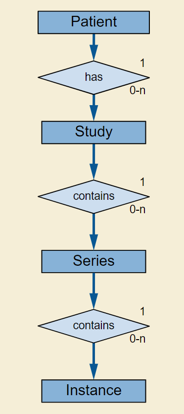
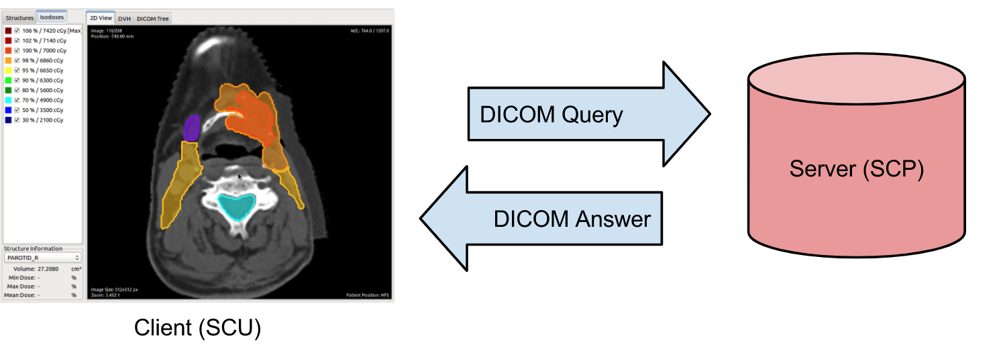
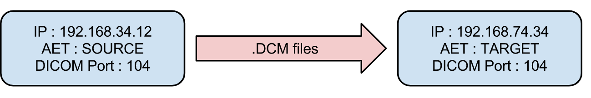
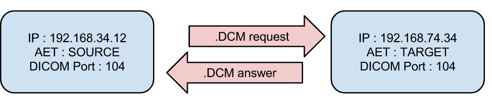

原文:
https://book.orthanc-server.com/dicom-guide.html
本文的目的旨在帮助开发者了解DICOM文件的格式，这里提供全文的翻译。
<!-- more -->

​	Orthanc Book的这一部分提供了对DICOM的相对简单、非正式和高级介绍。我们将尝试将DICOM的概念映射到一个现代术语中，希望对于第一次深入DICOM的软件工程师来说，这个术语更容易理解。一旦理解了本页的概念，有兴趣的读者可以阅读关于DICOM的更正式的教科书，如所谓的“实用介绍和生存指南”，或阅读完整的DICOM规范。

[Practical introduction and survival guide](https://www.springer.com/us/book/9783642108495)

[DICOM specification](http://dicom.nema.org/medical/dicom/current/output/html/)

​	本文中定义的所有DICOM概念都用Orthanc进行了说明，Orthanc是一款轻量级但功能强大的独立DICOM服务器，用于医疗保健和医学研究。Orthanc是免费的开源软件，是学习DICOM的好伙伴。


## DICOM 文件格式

DICOM标准可以大致分为两部分:

- DICOM 文件格式的部分。

- DICOM 网络协议部分。

DICOM文件格式是本节的主题。它本质上类似于众所周知的格式，如JPEG、PNG或TIFF。然而，除了对医学图像本身进行编码的所谓“像素数据”（**pixel data**）之外，DICOM文件还嵌入了医学信息。


### DICOM tags

​	DICOM文件编码的医疗信息称为数据集（**data set**），采用键值关联数组 （[key-value associative array](https://en.wikipedia.org/wiki/Associative_array)）的形式。每个值本身可以是一个数据集列表(称为序列 **sequence**)，导致类似于XML或JSON文件的分层数据结构。

​	在DICOM术语中，每个键称为**DICOM tag**。标准DICOM标签列表由一个官方字典进行规范化，每个标签由两个16位十六进制数字标识。例如，患者的出生日期与 DICOM tag **(0x0010, 0x0030)** 相关联。请注意，通常省略" 0x "前缀，而只写**0010,0030** 。为了更好的可读性，通常用驼峰命名法 (例如 “*PatientName*” or “*StudyDescription*”)。该标准将每个DICOM tag与一个数据类型(a string, a date, a floating-point number……)关联起来，这就是它的 值表示（**value representation** 简称 **VR**） 。

​	以下是 Orthanc Explore r如何显示存储在DICOM文件中的DICOM tag (注意该文件包含 tag ProcedureCodeSequence  (0x0008, 0x1032) tag 的序列):


​	

​	DICOM文件格式还指定了一组DICOM tag，这些 tag 对于每种成像方式(CT、MR、NM、CBCT、PET…) 都是必填的或可选的。这种规范称为 **storage service-object pair** (storage SOP)。必填 tag 称为“*type* 1”，可以有空值的 必填 tag 称为“*type* 2”，可选 tag 称为“*type* 3”。

​	DICOM标准还允许供应商引入非标准的专有 tag 供他们自己使用。专有 tag 可以通过其第一个十六进制数 是否位 奇数(例如(0x0009, 0x0010))来识别。显然，为了实现最大程度的互操作性，应该避免使用这种专有 tag。


### 像素数据

​	图像本身与 DICOM tag `PixelData (0x7fe0, 0x0010)` 相关联。图像的内容可以使用多种图像格式进行压缩，如JPEG、无损JPEG或JPEG 2000。显然，为了避免医疗信息的丢失，应该始终采用无损压缩。请注意，DICOM文件还可以作为使用MPEG-2或H.264编码的视频的包装器。

​	通过检查与DICOM文件头中关联的 **传输语法**，可以识别图像压缩算法。

​	在实践中，除了PACS本身，医院中很少有成像设备支持图像压缩。因此，为了确保最佳的可移植性，在医院中流通的大多数DICOM文件的像素数据通常是 **不压缩的**。换句话说，图像被编码为一个 原始缓冲区（raw buffer），具有给定的宽度、高度、像素类型(整数或浮点数)、颜色深度(通常为每像素8、10、12 bpp位)，光度表示(通常为灰度或RGB)。与这种未压缩图像相关联的传输语法可以是小字节序(最常见的情况)，也可以是大字节序(DICOM标准的最新版本中已经取消了)。

​	将一个DICOM实例从某种传输语法转换为另一种语法的过程称为**编码转换**。代码转换的主题在一个单独的FAQ条目中介绍。

​	[separate FAQ entry](https://book.orthanc-server.com/faq/transcoding.html#transcoding)

​	DICOM图像可以是 **多帧的**，这意味着它对不同图像帧的数组进行编码。例如，这用于编码未压缩的视频序列，这些序列通常被称为**cine** 或 **2D+t** 图像 (如超声成像)。

​	正如在其DICOM一致性声明中所写，Orthanc软件可以接收、存储和发送任何类型的DICOM图像(即支持所有标准的传输语法)。此外，Orthanc可以将大多数未压缩的图像转换为PNG图像。Orthanc之所以选择PNG格式，是因为它是无损的，受到许多浏览器、软件或编程框架的原生支持，并且能够编码高达16bpp的整数像素。在Orthanc Explorer中预览DICOM图像时，会发生这种实时转换为PNG图像的情况:


### 真实世界的模型

以上就是我们对DICOM文件格式本身的概述。现在我们有必要概述一下所谓的“现实世界的DICOM模型”([source](http://dicom.nema.org/medical/dicom/current/output/html/part04.html#sect_C.6.1.1)):



​	这个UML图显示了一个特定的病人 **patient**  在她的一生中受益于一组医学成像研究 **studies**。每项研究 **study** 都是由一套序列 **series**组成的。每个 系列 **series**  由许多的 **instances** 组成，后者是单个DICOM文件的同义词。在Orthanc的词汇表中，**DICOM资源** 是一个总括术语，用于讨论 a **patient**, a **study**, a **series** or an **instance**。

​	任何影像研究都可以与多组影像相关联。这一点在核医学中尤其明显，因为任何PET-CT扫描研究都至少包含两个单独的系列:CT序列和PET序列。但任何一种成像研究通常都会产生一系列独立的序列。一般来说，一个序列可以被认为是一个单一的2D图像(如标准数字射线照相)，一个单一的3D体积(如ct扫描)，或一个2D+t cine 的一组。但是一个序列也可以编码一个单一的PDF报告，一个结构化的报告，一个3D+t图像(即 3D图像的时间序列)…

​	在任何情况下，给定序列的实际像素数据都分布在多个DICOM 实例 中。这允许将单个大图像(医学图像通常处理4GB的图像)分割成数百个几兆字节的小文件，每个小文件可以完全装入计算机内存，代价是嵌入这些文件中的医疗信息严重冗余。

​	对于这4种DICOM资源中的每一种，DICOM标准将一个 **模块** 指定为一组描述这些资源的DICOM标记。例如，DICOM标记PatientName是patient模块的一部分，而SeriesDescription是series模块的一部分。任何存储服务-对象对(如上面定义的)都可以分解为一组模块，这些模块对其关联的模态类型有意义，其连接形式对所有医疗信息进行编码。

​	根据这个现实世界的模型，Orthanc的默认Web界面允许从患者层浏览到实例层。以下是Orthanc Explorer如何显示一个系列:


​	界面左侧显示了患者模块、研究模块和系列模块的概述。在右侧，可以访问该系列的多个实例。


### DICOM标识符

非常重要的是，DICOM标准指定了DICOM标签，允许对每个DICOM资源进行索引:

- 患者使用 PatientID (0x0010, 0x0020) (patient模块的一部分)进行索引。
- 研究使用 StudyInstanceUID (0x0020, 0x000d)(研究模块的一部分)进行索引。
- 系列使用 SeriesInstanceUID (0x0020, 0x000e)(系列模块的一部分)建立索引。
- 实例使用 SOPInstanceUID (0x0008, 0x0018) (SOP模块的一部分)进行索引


​	DICOM标准要求 StudyInstanceUID、SeriesInstanceUID  和 SOPInstanceUID 是全局唯一的。换句话说，强制要求两个不同的成像设备永远不要生成相同的标识符，即使它们是由不同的供应商生产的。Orthanc利用该规则派生自己的惟一标识符。

​	重要的是，即使PatientID在给定的医院内必须是惟一的，也不能保证它是全局惟一的。这意味着不同医院的不同患者可能共享相同的PatientID。因此，当您处理处理来自不同医院的患者的应用程序时，**应该始终从研究级别(而不是从患者级别)进行浏览。**

​	注意:从Orthanc 1.4.0开始，Orthanc Explorer界面提供了一个名为“Studies”的新标签，用于 研究 级别的访问。

​	最后，patient模块并不总是完全有意义的。例如，在紧急成像中，放射信息系统可能之前没有遇到成像患者。在这种情况下，急诊室的成像设备将与成像研究关联一个唯一的 `AccessionNumber (0x0008, 0x0050)` 一旦管理信息可用，随后将在PACS中注入患者模块，作为协调过程的一部分。

​	在任何情况下，核心引擎Orthanc保存所有这些DICOM标识符(PatientID, AccessionNumber, StudyInstanceUID, SeriesInstanceUID和SOPInstanceUID)的索引，并能够快速将它们映射到自己的内部标识符。这个查找是由Orthanc的REST API的/tools/lookup URI实现的。


后面是网络的部分，就摆烂了，随便拿翻译软件弄一下...


## DICOM网络协议

​	以上就是我们对DICOM文件格式的概述。如上所述，我们现在描述DICOM标准的第二个主要部分，即DICOM网络协议。

​	实际上，DICOM协议是最早的Web服务示例之一，早在引入SOAP或REST之前。它允许:

- **测试两台设备之间的连通性(C-Echo)。**
- **从本地成像设备发送图像到远端设备(C-Store)。**
- **搜索远程设备的内容(C-Find)。**
- **从远程设备(C-Move或C-Get)检索图像。**

下面是一张总结了一些关键概念的图片:



​	在DICOM术语中，DICOM服务的客户端称为**服务类用户(SCU)**，处理请求的服务器称为**服务类提供者(SCP)**。客户端发送一个编码为DICOM文件(命令)的请求，服务器用DICOM文件进行应答。

​	DICOM客户端到DICOM服务器的连接称为关联 **association**。这种关联从握手开始，客户机和服务器就可以在它们之间交换哪些命令以及支持哪些传输语法达成一致。这个协商的结果称为 表示上下文  **presentation context**。一旦关联协商成功，就可以使用该通信通道连续发送多个独立的命令。


### DICOM服务器参数

​	在历史上，DICOM协议被设计为在点对点链路上工作。现在，DICOM协议是在TCP/IP协议栈上使用的。这意味着可以通过指定其网络套接字的参数来识别DICOM服务器:

1. 它的IP地址(或者，相同地，它的符号DNS主机名)。
2. 它的TCP端口(标准的DICOM端口是104，但Orthanc默认使用非特权端口4242)。


​	此外，每个成像设备(可能是客户机或服务器)必须与称为 **应用程序实体标题(AET)** 的符号名称相关联。AET被认为是医院内部网中唯一的。为了厂商之间的最佳兼容性，AET应该只由大写字母数字字符(加上“-”和“_”字符)组成，长度必须小于16个字符。

​	IP地址、TCP端口和AET共同描述了DICOM服务器的所有参数。医疗成像网络的管理员应该仔细跟踪每个成像设备的这些参数，并应该定义一个全医院的政策，将AETs分配给新设备


### 配置Orthanc

​	Orthanc可以同时作为DICOM客户端和DICOM服务器，这取决于它的配置文件中的参数。要配置Orthanc的DICOM服务器，以下选项特别重要:

- `DicomServerEnabled` 必须设置为`true`。
- `DicomAet`必须设置为保留给Orthanc的AET。
- `DicomPort` 为DICOM服务器的TCP端口。


​	要将Orthanc配置为DICOM客户端，必须在 `DicomModalities` 选项中列出Orthanc已知的远程DICOM服务器。对于每个远程服务器，必须按照以下顺序指定:

- Orthanc Explorer(可能是它的AET)将显示的服务器的用户友好的符号名。
- 远程服务器的AET。
- 它的IP地址。
- 它的DICOM端口(最可能是104，如果远程服务器是Orthanc的另一个实例，则可能是4242)。


当然，在Orthanc的配置发生任何变化后，必须重新启动软件，来使用新的参数。

备注：`DicomModalities` 配置选项中的IP地址可能被远程模式(由DNS获得)的主机名替换。如果Orthanc充当这个远程模式的SCU，这将起作用。但是，如果远程模式充当一个可以联系Orthanc SCP的SCU，并且`DicomCheckModalityHost`选项设置为`true`，则必须使用一个IP地址。


### C-Echo:测试连接

​	路由器可能会在不同子网之间阻塞DICOM协议(通常，只有HTTP、HTTPS和SSH协议默认启用)。此外，安装在客户端或服务器上的防火墙也可能阻止DICOM协议。对于微软Windows防火墙和基于redhat的GNU/Linux机器来说尤其如此。因此，在医院的DICOM拓扑发生任何变化之后(特别是在连接两个成像设备时)，应该始终检查DICOM协议是否可以从一端传输到另一端，即在DICOM客户端和DICOM服务器之间。

​	这就是DICOM Echo服务发挥作用的地方。当客户端向服务器发送所谓的 `C-Echo` 命令作为其DICOM查询时，会触发该服务。服务器用一个空的DICOM回答。在实际操作中，要测试两台设备之间的连通性，您应该:

- 然后，使用标准命令行工具ping来测试客户机和服务器之间的 tcp 级连通性
- 从客户端发送C-Echo到服务器，测试 dicom 级的连通性。


第二步可以直接在Orthanc的嵌入式管理界面Orthanc Explorer的“查询/检索”面板中完成，如下图所示:


​	在这个截图中，`sample`对应于 `DicomModalities` 配置选项中声明的DICOM服务器的符号名。DICOM Echo成功后，客户端应该能够向服务器发送图像，并发起查询/检索。这是下面几节的主题。


### C-Store:向服务器发送图像

​	DICOM Store Service用于将DICOM实例发送到远程成像设备。当客户端向服务器发送所谓的C-Store命令以及DICOM实例的内容时，会触发此服务。C-Store的工作原理大致如下:



​	Orthanc既可以作为C-Store客户端(SCU)，也可以作为C-Store服务器(SCP)。换句话说，它既可以发送也可以接收DICOM文件。

​	在Orthanc Explorer界面中，每个DICOM资源(患者、研究、系列或实例)都带有一个名为“发送到远程模式”的按钮。单击此按钮允许将图像发送到 `DicomModalities`配置选项中声明的任何DICOM服务器。在下面的截图中，一个患者的所有实例将被发送到符号名称为sample的设备:


### C-Find:浏览服务器的内容

​	DICOM查找服务用于搜索由某个远程DICOM服务器托管的DICOM资源列表。必须指定要查找的资源类型(患者、研究或系列)，从而确定查询的查询级别。除了查询级别之外，查询还包含一组有关DICOM标记的过滤器:这些过滤器本质上是描述要查找的资源的通配符。当客户端向服务器发送一个所谓的C-Find命令，该命令对查询级别和过滤器进行编码时，会触发此服务。C-Find的具体工作如下:



​	Orthanc既可以作为C-Find客户端(SCU)，也可以作为C-Find服务器(SCP)。换句话说，它可以用于搜索远程服务器的内容，反过来，它也可以将自己的内容通知远程客户机。

​	在Orthanc Explorer界面中，可以在研究级别启动搜索。这个功能可以在“查询/检索”面板中使用，如下所示:


​	这张截图显示，我们正在寻找一项研究，其相关患者的名字以“大脑”开始，这是磁共振模式。Orthanc Explorer随后列出了匹配研究:


​	然后，可以点击一些配对研究，列出它是由下列各个系列组成:


### C-Move:查询和检索

​	这就给我们带来了DICOM网络协议的最后一个重要组件，DICOM移动服务。根据C-Find查询的结果，该服务主要用于从远程服务器本地检索DICOM文件。综合起来，C-Find和C-Move产生了查询/检索机制，是医院内部DICOM文件交换的核心。

​	C-Move可能是DICOM标准中不太直观的部分，这导致了医学成像网络中的许多配置问题。这是因为C-Move实际上并不局限于查询/检索。


​	每当一个成像设备(上面称为发行者)启动一个C-Move命令时，它会请求DICOM服务器(上面称为源)将它的一些图像发送到另一个DICOM服务器(上面称为目标)。因此，C-Move命令将要发送的DICOM资源的标识符与目标服务器的AET一起编码。换句话说，C-Move命令驱动两个远程DICOM服务器(源服务器和目标服务器)之间的C-Store。

​	查询/检索机制对应于C-Move命令的特殊情况，其中目标和颁发者是相同的成像设备。因此，查询/检索中最常见的配置问题是忘记在“源”设备的配置中声明“颁发者/目标”设备的AET。

​	Orthanc既可以作为C-Move客户机(SCU)，也可以作为C-Move服务器(SCP)。这意味着Orthanc既可以发起查询/检索，也可以作为查询/检索请求的一部分被驱动。您可能想看看本书的“配置DICOM查询/检索”一节，了解如何具体配置Orthanc进行查询/检索。

​	在完成C-Find查询后，可以从Orthanc Explorer界面发起C-Move会话。只需点击感兴趣的研究或系列右侧的下载按钮即可:


​	然后弹出一个对话框，询问目标模态的AET。默认情况下，这个字段是用Orthanc的AET预填充的，它对应于一个查询/检索的开始:


注1:即使C-Move似乎违反直觉，这是对PACS服务器发起查询/检索的最流行和广泛的方式。DICOM标准提供了一种名为DICOM C-Get的替代机制，该机制已在Orthanc 1.7.0中引入(见下文)。

注2:如上所述，Orthanc引擎是非常通用的，并与许多图像压缩算法(aka。传输语法)。特别是，在表示上下文的协商过程中，Orthanc报告默认情况下它与jpeg2000编码兼容。这导致一些PACS引擎在将图像发送给Orthanc之前先压缩图像，以减少网络带宽。不幸的是，由于许多医学图像分析软件与这种图像压缩不兼容，Orthanc接收到的JPEG 2000图像可能无法被此类软件使用。查看关于DICOM转码的FAQ，了解更多关于在DICOM协议上转换转换语法的信息。


### C-Get:使用单个SCP进行检索

​	Orthanc 1.7.0引入对DICOM C-Get SCP的支持。DICOM C-Get提供了DICOM C-Move的一个更简单的替代方案，如果发行者和目标(如C-Move一节所描述的)对应相同的模式:


​	在C-Get的情况下，与C-Move相反，目标模式不需要充当C-Store SCP:请求的数据通过C-Get请求所在的DICOM关联直接发送回客户端。因此，C-Get请求并不依赖于将DICOM从移除源移动到移除目标所建立的独立关联。相反，C-Get返回发出请求的同一个连接，并重用该连接来接收入站C-Store操作。

​	这样做的好处是简化了SCU的设计(在源模式中只需要一个DICOM服务器)，并简化了网络配置(C-Get不是通过C-Move进行查询/检索时的双向，而是从颁发者到源的单向，这简化了防火墙规则)。然而，C-Get不如C-Move通用，在临床PACS工作流程中也不常见。DICOM查看器更经常使用它。还要注意DICOMweb WADO-RS是为与C-Get相同的用例而设计的。

​	关于C-Get DICOM请求的完整描述，以及C-Get相对于C-Move的优势，请参阅David Clunie的博客文章。

​	实际上，要使用C-Get检索DICOM实例，必须提供一个或多个惟一的键属性(PatientID、StudyInstanceUID、SeriesInstanceUID或SOPInstanceUID)。例如，可以通过C-Find请求检索该信息。作为一个例子，让我们考虑以下最简的Orthanc配置:

```
{
  "DicomModalities" : {
    "getscu" : [ "GETSCU", "localhost", 2000 ]
  }
}
```

有了这个配置，下面是一个示例命令行，使用DCMTK工具包调用Orthanc的C-Get SCP，并给出一些已知的StudyInstanceUID:

```shell
$ getscu -v localhost 4242 -aec ORTHANC -k "0008,0052=STUDY" -k "0020,000d=1.2.840.113543.6.6.4.7.64067529866380271256212683512383713111129"
```

注意:从Orthanc 1.9.7开始，Orthanc只实现C-Get作为服务类提供者(SCP)。Orthanc目前不支持使用C-Get作为服务类用户(SCU)。

### 使用HTTP而不是DICOM协议

​	我们坚持DICOM协议本质上针对的是单个医院的内部网，而不是互联网或云，以此来总结对DICOM的简要概述。该协议可能会被出站防火墙阻止，而且没有约定确保所有医院的AETs是全球唯一的。

​	此外，尽管Orthanc支持DICOM TLS加密，但该功能在医院中很少启用。因此，您可能希望在DICOM上下文中利用HTTP协议，这取决于您的应用程序。这种基于web的协议可能对医生/物理学家/软件工程师更熟悉，更容易使用，可以透明加密(HTTPS)，并与多医院场景兼容。为此，你有两种可能:

- 求助于Orthanc对等机制。因为每个Orthanc服务器都带有其内置的REST API，远程系统可以获得对Orthanc内容的完全编程控制。这种访问可以通过HTTP身份验证和SSL加密来保护。Orthanc Explorer接口可以透明地使用这种对等机制通过HTTP(S)发送DICOM文件。
- 求助于DICOMweb标准，它是DICOM标准的扩展，指定了如何通过HTTP(S)访问远程DICOM服务器的内容。由于对等机制被绑定到Orthanc, DICOMweb提供了对远程服务器的表达性较差但更通用的访问。重要的是，Orthanc的DICOMweb插件是免费的。

