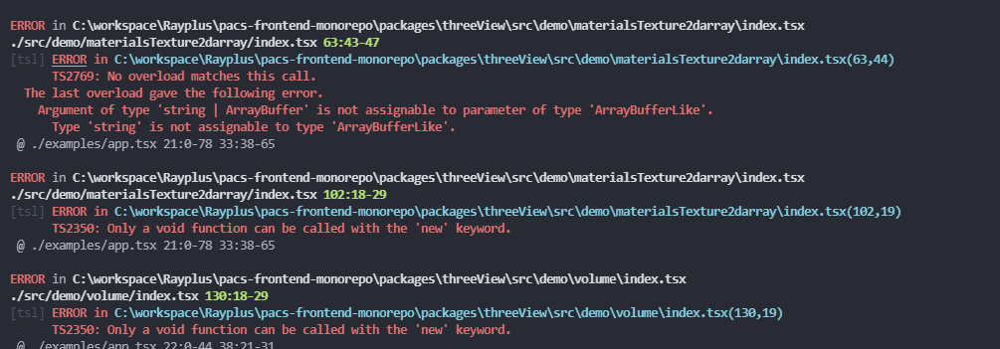

react-three-fiber 是一个利用React的特性，来封装three.js的库，让three.js和react结合起来更方便使用。

<!-- more -->


## 报错记录

### ts 报错 is missing the following properties from type

**解决方式：**

来自discord


但是安装 @types/three 会引发更多的报错




部分问题似乎是之前写的不规范导致，改正后可以修复


### source map loader 报错


目前无解决方案，只能暂时忽略这个错误

webpack中增加配置

```javascript
  // 忽略报错
ignoreWarnings: [/Failed to parse source map/],
```


### 编译出现警告


@chevrotain 的这个内部包，似乎有点不规范


### 使用 shaderMaterials 出现问题

然后放到mesh之类的组件里面用的话，会报出错误：

Class constructors cannot be invoked without 'new'

目前尚无比较好的解决方案，只能先这样写：

```javascript
const Uint16Material = {
  uniforms: {
    diffuse: { value: undefined },
    depth: { value: 20 },
    size: { value: new THREE.Vector2(0, 0) },
    ww: { value: undefined },
    wl: { value: undefined },
    rescaleSlope: { value: 1 },
    rescaleIntercept: { value: 0 },
    type: { value: 0 },
    numOfSlice: { value: 0 },
  },
  vertexShader: RENDER_VERTEX_SHADER,
  fragmentShader: RENDER_FRAGMENT_SHADER,
};

<mesh ref={ref}>
    <planeGeometry args={[50, 50]} />
    <shaderMaterial attach="material" args={[Uint16Material]} />
</mesh>
```


## 测试记录

### 在 pacs-frontend 中测试基础demo


目测来看是没有什么别的问题了，除了编译的时候，内部包会因为存在不规范而报错。


## QA

### 为什么例如 mesh 这种标签，不需要通过import 引入？

所有three.js对象都将被视为原生JSX元素，就像你可以在常规的ReactDOM中写 <div /> 或 <span />

一般的规则是，在three.js中，Fiber组件的名称以驼峰形式出现。

来源 https://docs.pmnd.rs/react-three-fiber/getting-started/your-first-scene

