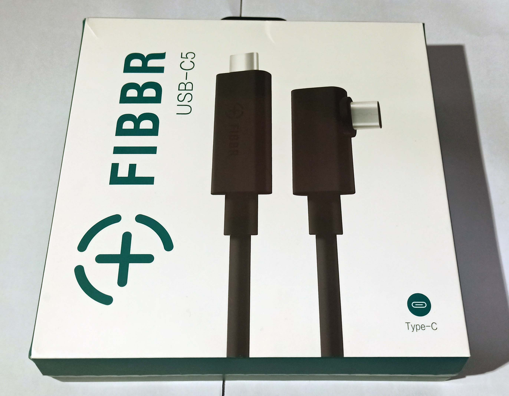
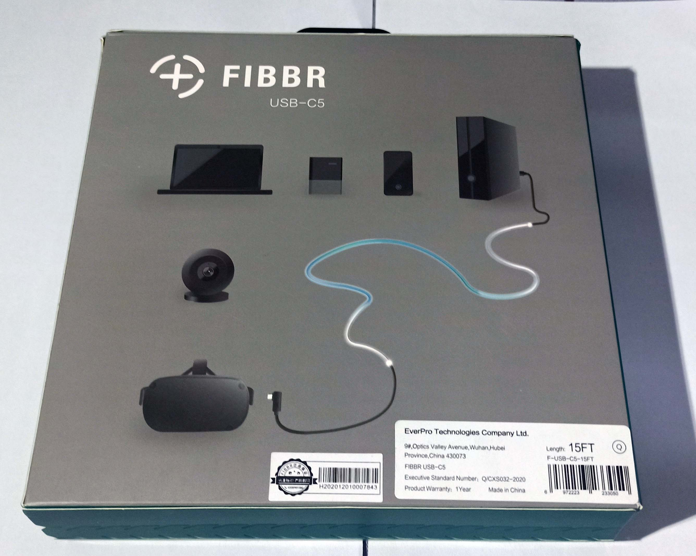
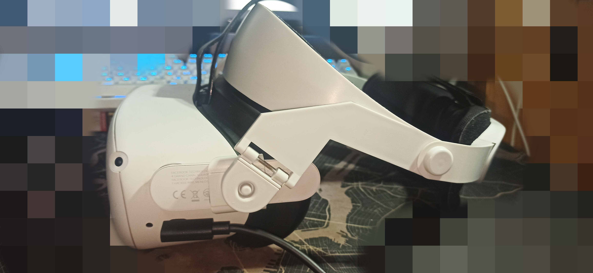
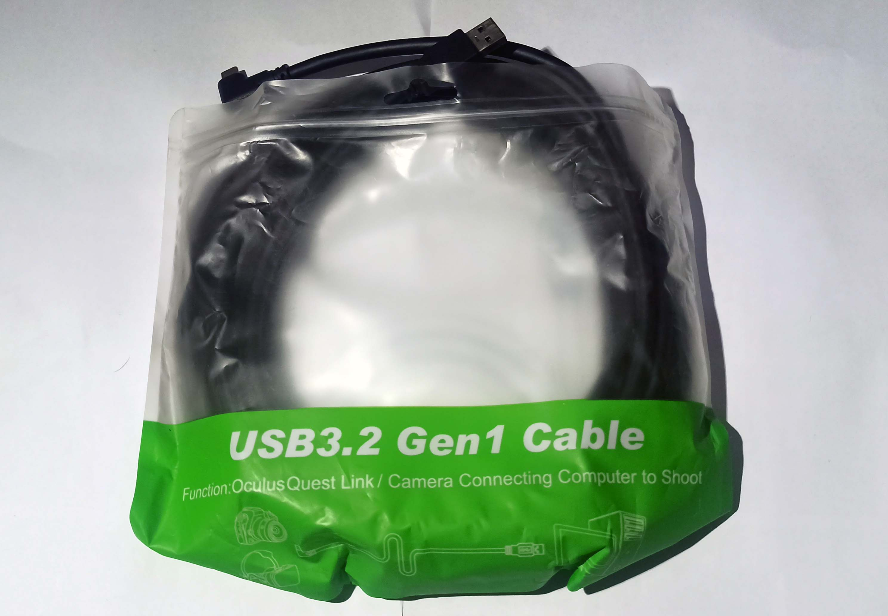
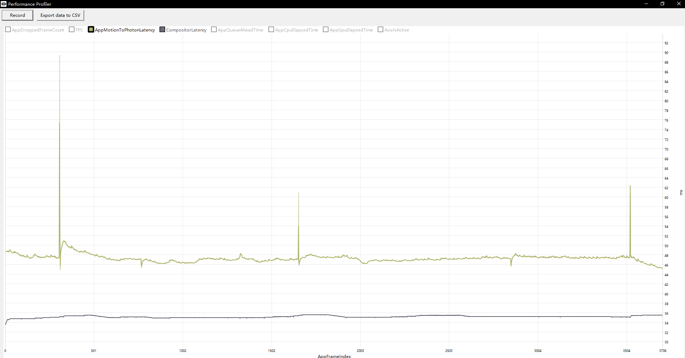

## 🔵前言

​        如今越来越多的VR一体设备进入市场，如Oculus quest 2，PICO，Vive VR等，玩家可以在一体机上很方便的游玩安卓平台的VR游戏，也能够通过串流的方式来玩PC平台上的高画质VR游戏。主流的串流方式主要有利用USB线，或者利用路由器来传送数据，如果选用USB进行串流的话，那么一根高质量的USB数据线就十分重要。

<!-- more -->

## 🔵FIBBR菲伯尔 串流线

​        作为一名VR玩家，这一次非常荣幸收到FIBBR官方送串流线，我也是第一次写和VR串流相关的测评，如果有不专业的地方希望大家谅解。

​        这一次由于库存不足的原因，FIBBR官方给我发发的是FIBBR串流光纤线的海外版，但是它和国行的版本在使用上应该不会有太大的区别。

### 🔹产品的包装

海外版的正反面的包装比较简约，主要介绍了串流线的用途和规格。

我们可以看到产品的背面包装图上写着，产品的长度为15FT，FT是英寸的单位，15FT大概是4.57米，官方线的长度是5米，只比官方线略短了不到0.5米，实际游玩下来，这个长度已经能够满足大多数玩家对于游玩VR游戏的一个需求。

### 🔹产品的内部

​        我们可以看到FIBBR的串流线的设计和官方出品的串流线都是采用一段直插一段弯插的设计，这样非常利于在VR设备上进行使用。

​        线材使用了3个绑带绑好，对于后续的收纳来说是十分方便的。并且在线材的两端都用了透明的塑料薄膜，和塑料壳进行保护。

### 🔹与Oculus quest 2 连接

我用了一个在tb上买的头戴，并不是官方的头戴。串流线只需要和quest2设备的usb口连接，另一端和PC端连接就好了，PC上需要有一个type-c的接口，而不是USB的接口。

## 🔵实际串流体验

接下来就是重要部分了，实际测试一下该线在串流游玩VR游戏的具体表现。

### 🔹测试平台

**操作系统**	Windows 10 专业版 64位 ( DirectX 12 )
**处理器**	英特尔 Core i7-6700K @ 4.00GHz 四核
**主板**	华硕 Z170-AR ( 100 Series/C230 Series 芯片组 Family - A145 )
**内存**	16 GB ( 金士顿 DDR4 2666MHz )
**显卡**	Nvidia GeForce GTX 1070 ( 8 GB / Nvidia )

高情商来说就说，这一套平台是比较亲民的，可能能够反映大多数玩家的一个情况，低情商来说，对于VR游戏来说属于是比较低配的一套平台了。但是在显卡价格这么高，想买到原价的30系显卡特别困难，所以一直没有升级电脑配置，哎....

### 🔹对比的串流线

之前曾经在tb上买过一条比较廉价的usb数据线，就以它为对比：

### 🔹使用的画质设置

由于电脑配置比较一般，所以72HZ和1.0的分辨率

### 🔹测试游戏

测试的游戏选用的是《半条命：alyx》 

实际游玩下来的感受是，TB买的线经常出现断流，连接不良的情况，导致游玩中断，而FIBBR的线不会出现这种情况，整个游玩的过程都比较稳定。

#### FIBBR线

串流延迟全程大概在46~48ms左右，比较稳定

#### TB买到串流线

串流延迟全程大概在55ms左右,有些时候会特别高

### 🔹总结

​        由于电脑配置本身不高，所以看起来串流延迟都比较高，但是相比一般的type-c线而言，FIBBR线对于串流游玩VR游戏存在一定程度的提升，减少了串流的延迟，相比一般的线而言更加稳定，不会出现断流的情况。

