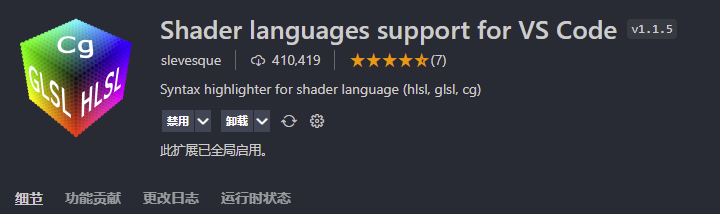
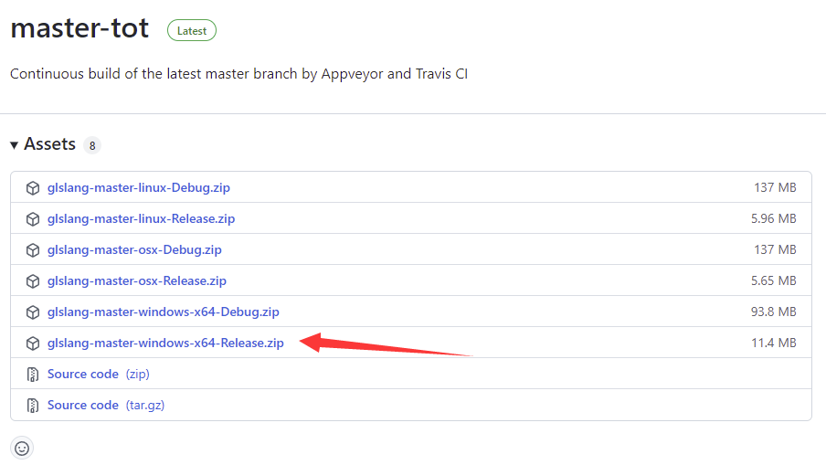
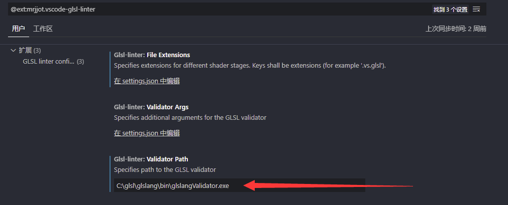
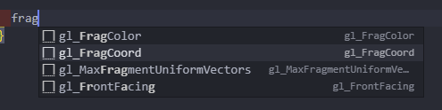
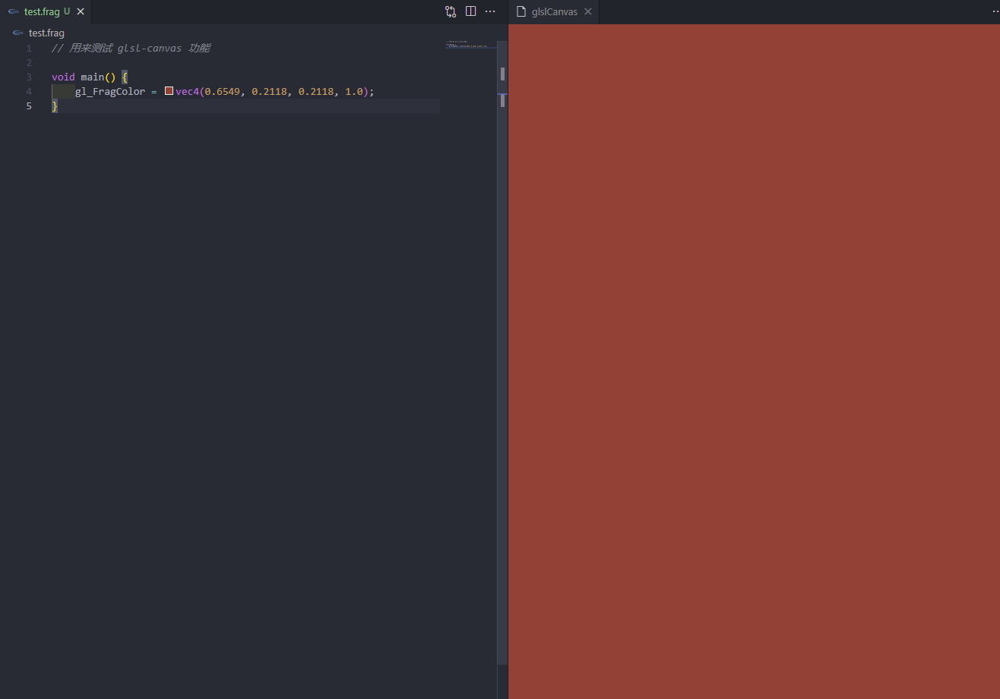

在vscode中如何写shader代码的整理

<!-- more -->

ps: 本次整理的内容截止 2021.12.15 能在vscode上正常使用

## 🔹代码高亮

安装插件：

**Shader languages support for VS Code**




安装之后，shader 代码应该就有高亮显示了：

目前支持的文件后缀：

|  ID  | 名称 | 文件扩展名                                                   | 语法 | 片段 |
| :--: | :--- | :----------------------------------------------------------- | :--- | :--- |
| hlsl | hlsl | `.sf`                                                        | —    | —    |
| glsl | GLSL | `.vs` `.fs` `.gs` `.comp` `.vert` `.tesc` `.tese` `.frag` `.geom` `.glsl` `.glslv` `.glslf` `.glslg` | ✔︎    | —    |
|  cg  | Cg   | `.cg`                                                        | ✔︎    | —    |


## 🔹静态代码检查

安装插件：

**GLSL Linter**

另外还有一个插件 **GLSL Lint**，目前尝试没有成功使用...

所以后面暂时都使用 **GLSL Linter**


安装插件之后，需要下载 glslang：

https://github.com/KhronosGroup/glslang/releases




之后需要设置一个路径：




这样做了之后可能还是会报错 **GLSL validator returned exit code 1**

请参考这个 issues:

https://github.com/Jacajack/vscode-glsl-linter/issues/4

**更改配置文件为**

```json
  "glsl-linter.validatorPath": "C:\\glsl\\glslang\\bin\\glslangValidator.exe",
  "glsl-linter.fileExtensions": {
    ".fs.glsl": "frag",
    ".fs": "frag",
    ".vs.glsl": "vert",
    "vs": "vert",
    ".tes.glsl": "tese",
    ".tcs.glsl": "tesc",
    ".gs.glsl": "geom"
  }
```

**并且 shader 文件不要以 .glsl 来结尾！！！**


## 🔹代码格式化

安装插件 **Clang-Format**


设置代码格式化程序为 **Clang-Format**

然后使用快捷键 **ctrl + alt +f** 即可格式化


## 🔹代码补全

**ctrl + shift + p 快捷键**

输入 **>user snippets**

然后输入 **glsl**

进入 **glsl.json**


进入链接：https://gist.github.com/lewislepton/8b17f56baa7f1790a70284e7520f9623

将代码复制到 glsl.json中，即可出现代码补全




## 🔹快速展示

安装插件 **glsl-canvas**

使用方法：

**ctrl + shift + p 快捷键**

输入 **show glslCanvas**

简单效果:




## 🔹shader 文件导入 three.js

### Games202 中的方法参考

直接读取文件，然后获得字符串

**使用例**

```javascript
material = buildPhongMaterial(colorMap, mat.specular.toArray(), light, Translation, Scale, "./src/shaders/phongShader/phongVertex.vs", "./src/shaders/phongShader/phongFragment.fs");
```

**buildPhongMaterial 方法**

```javascript
async function buildPhongMaterial(color, specular, light, translate, scale, vertexPath, fragmentPath) {


    let vertexShader = await getShaderString(vertexPath);
    let fragmentShader = await getShaderString(fragmentPath);

    return new PhongMaterial(color, specular, light, translate, scale, vertexShader, fragmentShader);

}
```

**getShaderString 方法**

```javascript
async function loadShaderFile(filename) {

    return new Promise((resolve, reject) => {
        const loader = new THREE.FileLoader();

        loader.load(filename, (data) => {
            resolve(data);
            //console.log(data);
        });
    });
}

async function getShaderString(filename) {

    let val = ''
    await this.loadShaderFile(filename).then(result => {
        val = result;
    });
    //console.log(val);
    return val;
}
```


### webpack 的方法

首先需要安装 **raw-loader**

```shell
$ yarn add raw-loader --dev
```

配置 **webpack** ，例子：

```javascript
{
    test: /\.(glsl|vs|fs|vert|frag)$/,
    exclude: /node_modules/,
    use: ['raw-loader'],
},
```

然后shader文件，直接导入即可

**使用例：**

```javascript
import vertexShaderFirstPass from './shaders/vertexShaderFirstPass.vert';
import fragmentShaderFirstPass from './shaders/fragmentShaderFirstPass.frag';
...
...
const materialFirstPass = new THREE.ShaderMaterial({
    vertexShader: vertexShaderFirstPass,
    fragmentShader: fragmentShaderFirstPass,
    // 定义将要渲染哪一面 - 正面，背面或两者
    // BackSide，FrontSide，DoubleSide
    side: THREE.BackSide,
});
```


## 🔹目前已知缺陷（主要是和three.js 使用）

### 静态检查不正确

注意，和一同three.js使用的时候，three.js帮我们内置了变量

请参考：

https://threejs.org/docs/index.html?q=webgl#api/zh/renderers/webgl/WebGLProgram


所以可能会出现如下问题：

undeclared identifier

not supported for this version or the enabled extensions

等等...


**这可能是由于 three.js 中使用shader 会对你写的shader重新封装...**

**例如：**

这一段传入的代码会被 three.js 重新封装

```glsl
out vec3 worldSpaceCoords;
void main()
{
    //Set the world space coordinates of the back faces vertices as output.
    worldSpaceCoords = position + vec3(0.5, 0.5, 0.5); //move it from [-0.5;0.5] to [0,1]
    gl_Position = projectionMatrix * modelViewMatrix * vec4( position, 1.0 )
}
```

实际输出的代码为：

```glsl
1: #version 300 es
2: precision mediump sampler2DArray;
3: #define attribute in
4: #define varying out
5: #define texture2D texture
6: precision highp float;
7: precision highp int;
8: #define HIGH_PRECISION
9: #define SHADER_NAME ShaderMaterial
10: #define VERTEX_TEXTURES
11: #define GAMMA_FACTOR 2
12: #define MAX_BONES 0
13: #define BONE_TEXTURE
14: #define FLIP_SIDED
15: uniform mat4 modelMatrix;
16: uniform mat4 modelViewMatrix;
17: uniform mat4 projectionMatrix;
18: uniform mat4 viewMatrix;
19: uniform mat3 normalMatrix;
20: uniform vec3 cameraPosition;
21: uniform bool isOrthographic;
22: #ifdef USE_INSTANCING
23: 	attribute mat4 instanceMatrix;
24: #endif
25: #ifdef USE_INSTANCING_COLOR
26: 	attribute vec3 instanceColor;
27: #endif
28: attribute vec3 position;
29: attribute vec3 normal;
30: attribute vec2 uv;
31: #ifdef USE_TANGENT
32: 	attribute vec4 tangent;
33: #endif
34: #if defined( USE_COLOR_ALPHA )
35: 	attribute vec4 color;
36: #elif defined( USE_COLOR )
37: 	attribute vec3 color;
38: #endif
39: #if ( defined( USE_MORPHTARGETS ) && ! defined( MORPHTARGETS_TEXTURE ) )
40: 	attribute vec3 morphTarget0;
41: 	attribute vec3 morphTarget1;
42: 	attribute vec3 morphTarget2;
43: 	attribute vec3 morphTarget3;
44: 	#ifdef USE_MORPHNORMALS
45: 		attribute vec3 morphNormal0;
46: 		attribute vec3 morphNormal1;
47: 		attribute vec3 morphNormal2;
48: 		attribute vec3 morphNormal3;
49: 	#else
50: 		attribute vec3 morphTarget4;
51: 		attribute vec3 morphTarget5;
52: 		attribute vec3 morphTarget6;
53: 		attribute vec3 morphTarget7;
54: 	#endif
55: #endif
56: #ifdef USE_SKINNING
57: 	attribute vec4 skinIndex;
58: 	attribute vec4 skinWeight;
59: #endif
60: 
61: out vec3 worldSpaceCoords;
62: void main()
63: {
64:     //Set the world space coordinates of the back faces vertices as output.
65:     worldSpaceCoords = position + vec3(0.5, 0.5, 0.5); //move it from [-0.5;0.5] to [0,1]
66:     gl_Position = projectionMatrix * modelViewMatrix * vec4( position, 1.0 )
67: }
```


目前无解，和three.js配合使用时，请关闭代码检查的功能...


## 参考

VsCode安装shader glsl环境

https://zhuanlan.zhihu.com/p/151384233

Jacajack/vscode-glsl-linter

https://github.com/Jacajack/vscode-glsl-linter


